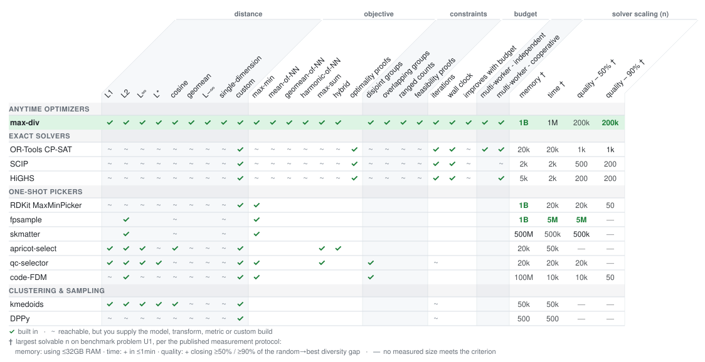

[](https://github.com/bertpl/max-div/actions/workflows/push_to_main.yml)


[](https://max-div.readthedocs.io/en/stable)
[](https://pypi.org/project/max-div/)
[](https://pypi.org/project/max-div/)
[](https://github.com/bertpl/max-div/blob/main/LICENSE)
[](https://github.com/astral-sh/ruff)
[](https://scorecard.dev/viewer/?uri=github.com/bertpl/max-div)
<p align="center">
  
</p>

# max-div

**A versatile, high-performance solver for Maximum Diversity Problems** — select the `k` most
diverse of `n` items, under optional fairness constraints.

## Highlights

- **Anytime**: returns a good selection quickly and keeps improving it for as long as you
  allow — a wall-clock or iteration budget, covering the whole solve end to end.
- **Four diversity objectives**, including **geometric-mean separation** — unique among freely
  available tools.
- **Overlapping fairness constraints**: per-group minimum/maximum quotas, supported natively by
  no other dedicated diversity solver.
- **Distance metrics** from L1 to Minkowski with caller-chosen power `p` — or bring your own
  precomputed distances.
- **Feasibility proofs**: witnesses for feasible constraint sets, certificates for infeasible
  ones, and an explicit *unknown* in between.
- **Parallel solving**: cooperative workers in dynamically consolidating groups.
- **Openly benchmarked** against 10 third-party tools, on a published measurement protocol.
- **Easy to adopt**: `pip install max-div`, Python 3.11+, free-threaded builds supported.

<p align="center">
  <picture>
    <source media="(prefers-color-scheme: dark)" srcset="docs/images/hero_dark.svg">
    
  </picture>
</p>

The [benchmarks](https://max-div.readthedocs.io/en/stable/benchmarks/comparison/overview/)
compare max-div in depth with exact MIP/CP solvers and one-shot pickers.

## Installation

```bash
pip install max-div
```

Python 3.11+; free-threaded builds (3.14t) are supported and CI-tested (see the
[installation notes](https://max-div.readthedocs.io/en/stable/getting_started/#installation) for
the numba version they require).

## Quick start

```python
import numpy as np
from max_div import MaxDivProblem, MaxDivSolverBuilder, seconds

rng = np.random.default_rng(42)
vectors = rng.random((200, 5))               # 200 points in 5 dimensions

# select the 20 most diverse, improving for up to 5 seconds
problem = MaxDivProblem.new(vectors, k=20)
solution = MaxDivSolverBuilder(problem).with_preset(seconds(5)).build().solve()

print(solution.i_selected)                   # indices of the selected items
```

### With fairness constraints

Require a minimum and/or maximum number of selected items from given subsets — useful for fair
representation across groups. Groups may overlap, and infeasible constraints degrade gracefully
to the least-infeasible selection rather than failing.

```python
from max_div import Constraint

# require between 8 and 12 of the selected items from each half of the data
constraints = [
    Constraint(int_set=set(range(0, 100)),   min_count=8, max_count=12),
    Constraint(int_set=set(range(100, 200)), min_count=8, max_count=12),
]
problem = MaxDivProblem.new(vectors, k=20, constraints=constraints)
```

## Documentation

Full documentation lives at **[max-div.readthedocs.io](https://max-div.readthedocs.io)**,
including:

- [Getting started](https://max-div.readthedocs.io/en/stable/getting_started/) — installation,
  distance and diversity metrics, solver presets
- [Comparison with other tools](https://max-div.readthedocs.io/en/stable/comparison/) — how
  max-div relates to exact solvers, greedy pickers, and samplers
- [Benchmarks](https://max-div.readthedocs.io/en/stable/benchmarks/comparison/overview/) — the
  measured comparison against third-party tools

## License

Licensed under the [Apache License 2.0](https://github.com/bertpl/max-div/blob/main/LICENSE).
