# Comparison Benchmarks — vs. Python Heuristics

How does `max-div` compare to the subset-selection tools a Python user would otherwise
reach for? This page benchmarks it against the surveyed single-shot heuristics (see the
[Comparison](../../comparison.md) page for the tool landscape) on the built-in
[benchmark problems](../solver/test_problems.md).

## Protocol

- **max-div** runs a wall-clock budget ladder (2× steps from 1 ms; the last rung is the
  first ≥ 10 s), one independent solve per budget × seed (3 seeds), `DEFAULT` preset (an
  alias of `SMART` — figures label it `max-div[DEFAULT]`). Figures
  plot *measured* solve time, never the nominal budget. One ladder per diversity metric —
  max-div optimizes the metric it is scored under.
- **Competitors** are single-shot: one run per seed, plotted as a dot at (measured time,
  quality).
- **Every** tool's selection is scored under max-div's own diversity metrics, computed
  identically for all tools.
- Labels matter: `apricot[facility-location]` optimizes coverage and `kmedoids[FasterPAM]`
  representativeness — they are included as different-objective references, not as
  dispersion competitors. `qc-selector` (GPL) is included when installed.
- Hardware: 16" MacBook Pro with M3-class CPU, single sequential run.
- Reproduce with `uv run --group benchmarks python -m benchmarks.tier2.full` (records),
  then `... -m benchmarks.tier2.report` (figures/tables).
- max-div figures measured against **v0.10.1**. Competitor values are deterministic
  single-shot runs, kept as tracked reference records.

## Key findings

Both readings matter, depending on whether the user is time-constrained:

**At a shared ~1 s budget:** max-div is ahead of the best single-shot picker on the
separation objectives at every size up to n = 5000. At n = 20000 (k = 2000) it trails —
by 4–13% on most cells, and far more on the hardest (U4 min-separation): a 1 s budget
fits only a few hundred iterations there, not even one improvement pass over the selected
set. A user who must answer in a second at that scale is better served by a
farthest-point picker.

**Given more time, max-div overtakes.** By ~16 s it matches or exceeds the best picker on
every problem for every separation metric (margins +0.0…+0.2%, the one exception a −0.4%
tie on U4 min-separation). The pickers are not free at this size either — `fpsample[FPS]`
takes ~5 s and `RDKit[MaxMinPicker]` ~10 s of wall clock at n = 20000 — so at parity with
their own run time max-div is within ~0.2%, and ahead beyond it.

**On `MEAN_PAIRWISE_DISTANCE` (classical max-sum), the greedy construction is the
benchmark.** max-div matches `greedy[max-sum]` at every size given seconds of budget — at
n = 20000 it reaches par by ~16 s, comparable to greedy's own ~20 s run time — but it does
not beat it. If pure max-sum is the only goal, the greedy baseline remains the pragmatic
choice.

**Where max-div is differentiated:** the separation-family objectives (ahead outright
below n ≈ 5000, ahead given its rivals' own run time above), the anytime property
(near-plateau quality within ~1 s at most sizes), and constrained selection (below) —
where the heuristic field thins out to a single competitor that stops at n ≈ 2000.

## Unconstrained results (U1, uniform density)

Anytime curves on U1 for the max-min and geomean objectives; the margin tables further
down cover all problems and metrics.

### MIN_SEPARATION

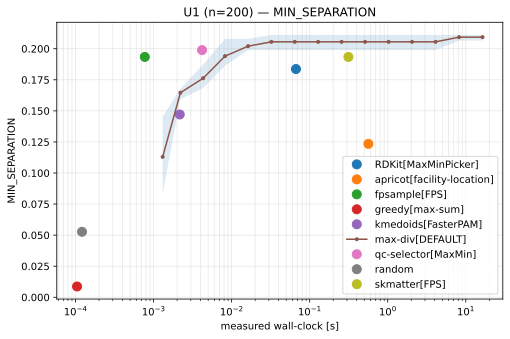
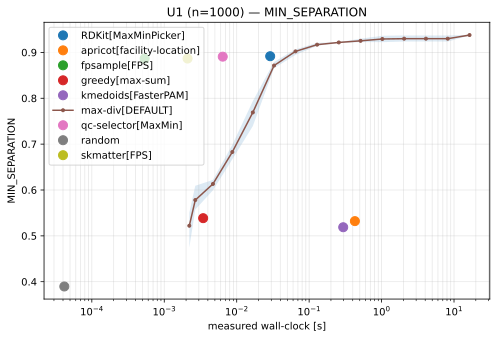
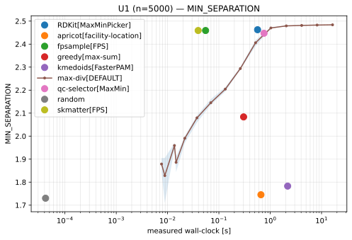
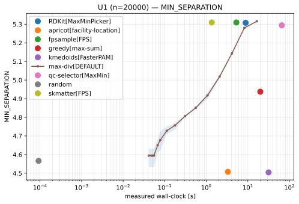

### GEOMEAN_SEPARATION

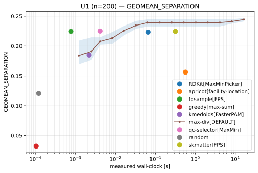
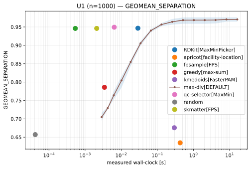
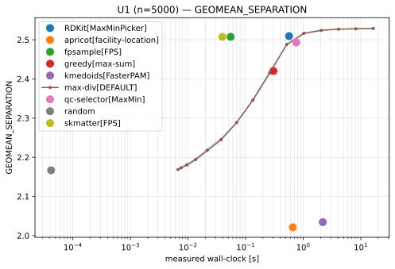
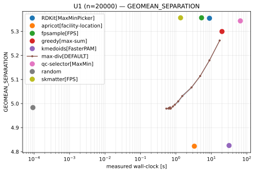

## Margin tables (all problems)

Each cell: max-div's margin vs. the *best* competitor under that metric, at ~1 s / ~16 s
of budget. Positive = max-div ahead.

### MIN_SEPARATION

--8<-- "docs/benchmarks/comparison/results/tier2_margins_min_separation.md"

### MEAN_SEPARATION

--8<-- "docs/benchmarks/comparison/results/tier2_margins_mean_separation.md"

### GEOMEAN_SEPARATION

--8<-- "docs/benchmarks/comparison/results/tier2_margins_geomean_separation.md"

### MEAN_PAIRWISE_DISTANCE

--8<-- "docs/benchmarks/comparison/results/tier2_margins_mean_pairwise_distance.md"

## Constrained results

With fairness constraints, the only surveyed heuristic competitor is
[code-FDM](https://github.com/yhwang1990/code-FDM) (FairFlow), and it bounds the comparison
twice over: it scales roughly cubically (~150 s at n = 2000, impractical beyond), and its
disjoint-color fairness model cannot even *express* overlapping constraint groups — so the
harder constrained problems (C3/C4) have no competitor at all. The comparison therefore
covers C1/C2 up to n = 2000; beyond either limit, no surveyed Python heuristic produces
constraint-satisfying selections (exact solvers can, at small n — see the
[exact-reference benchmarks](tier1.md)).

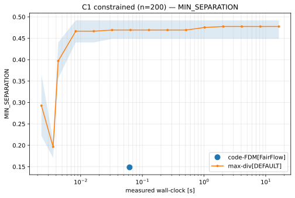
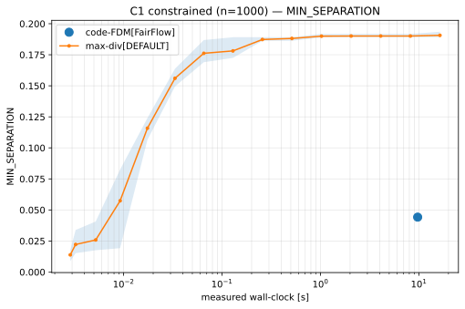
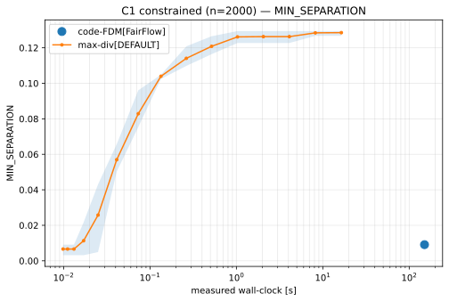

--8<-- "docs/benchmarks/comparison/results/tier2_margins_constrained.md"
