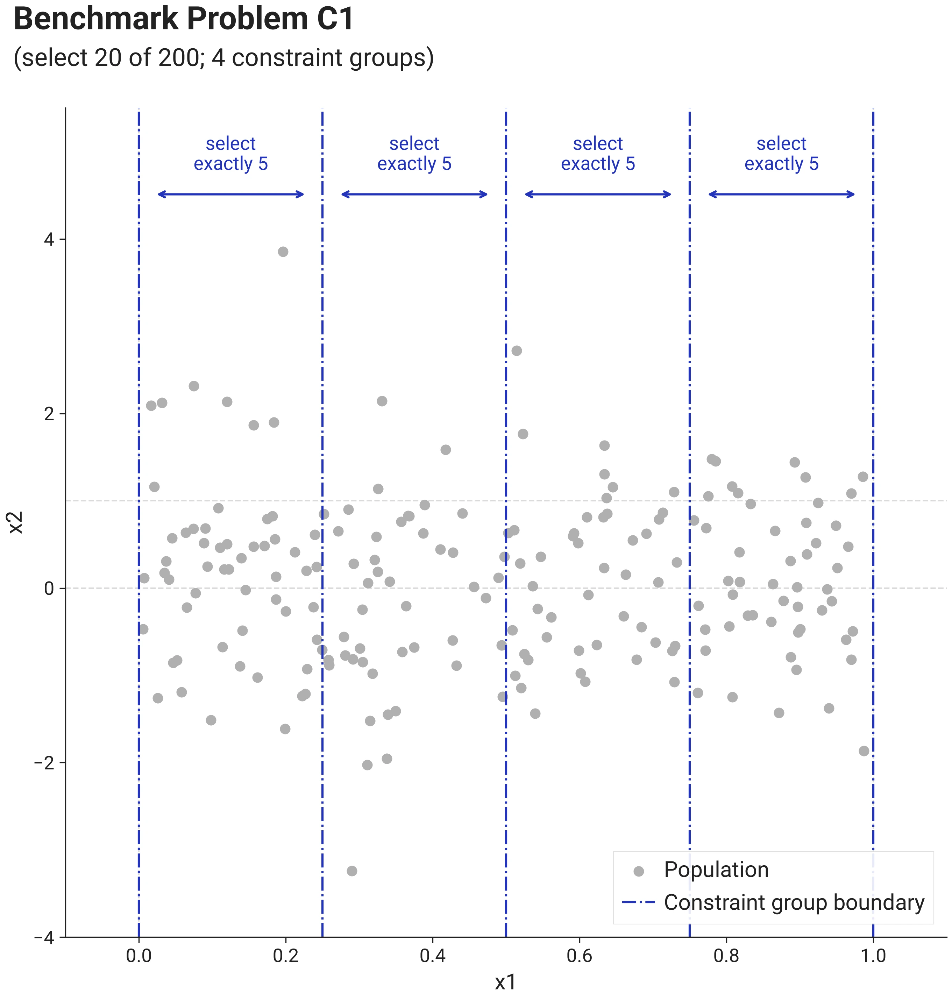
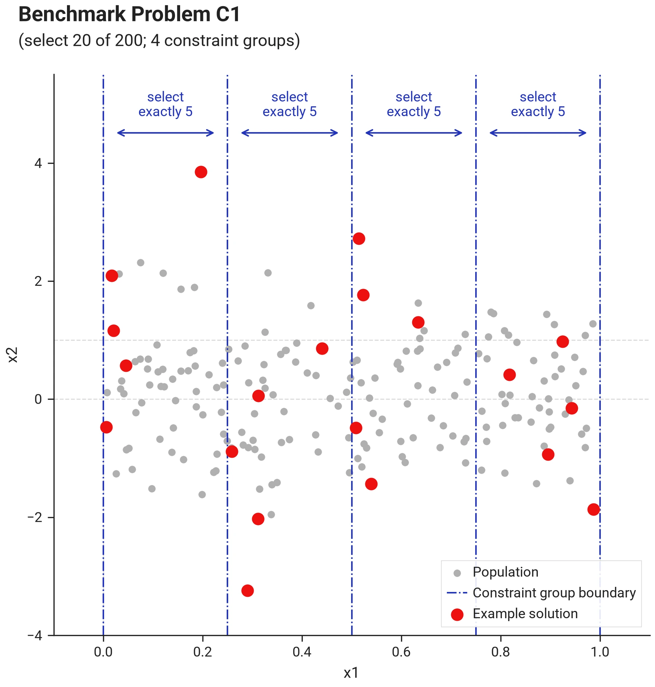
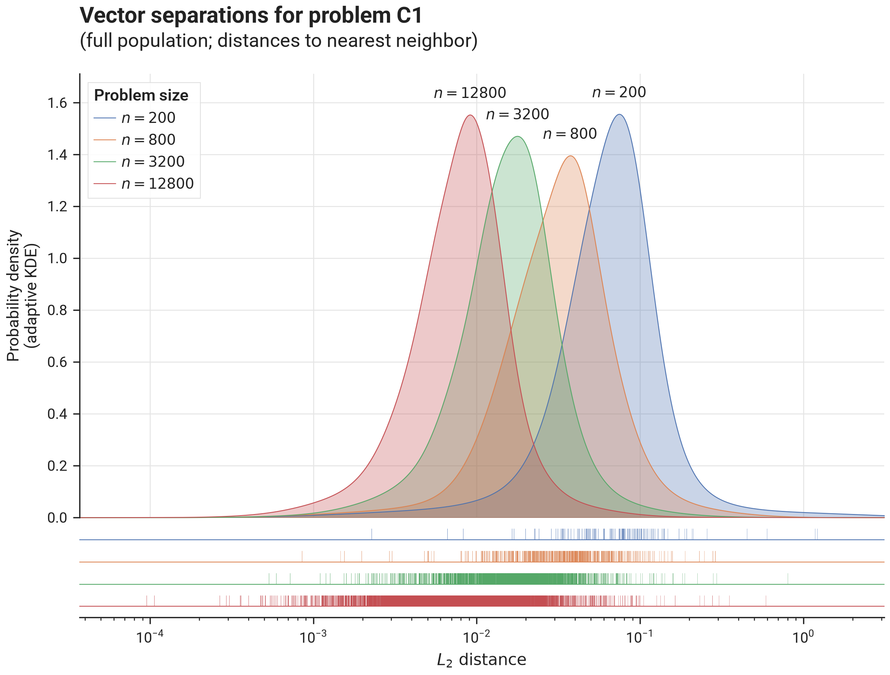

# Benchmark Results - Problem C1

## I. Problem Description

### A. Overall Approach

`C1` is the suite's **constrained reference problem for cross-tool comparisons**: its constraints are maximally restrictive — exact stratified quotas, the one constraint form that restricted third-party tools support.

Vectors are 2-dimensional and have...

- first component drawn from a uniform distribution over $[0, 1]$,
- second component drawn from a standard normal distribution $\mathcal{N}(0, 1)$.

All vectors are split in $m=\lceil k/5 \rceil$ non-overlapping groups, by splitting the range $[0, 1]$ of the first component into $m$ equal segments. Every vector lands in exactly one group, so the groups **partition** the population.

From each group an **exact** number of vectors must be selected: $5$ per group, with the last group taking the remainder $k - 5(m-1)$, so the quotas sum exactly to $k$. The count structure fully determines the per-group allocation, leaving a solver only the within-group choices.

### B. Visualization

This image shows problem C1 with $n=200$ (thus $d=2$, $k=20$, $m=4$):

{ .center }

The image below shows an example solution, obtained by using the `DEFAULT` solver preset over 10.000 iterations
using the L2 distance metric and the `geomean_separation` diversity metric:

{ .center }

### C. Separation statistics

The image below shows distribution of vector separations (distances to nearest neighbor for all vectors in the population),
for different problem sizes:

{ .center75 }

### D. Feasibility

--8<-- "docs/benchmarks/solver/results/note_measured_feasibility.md"

--8<-- "docs/benchmarks/solver/results/note_feasibility_methodology.md"

See [Proving Feasibility](../../concepts/feasibility.md) for the machinery behind these verdicts, and [Scoring](../../concepts/scoring.md) for the constraints-score scale.

--8<-- "docs/benchmarks/solver/results/feasibility_verdicts_C1.md"

## II. Benchmark results

- [Initialization Strategies](bm_problem_c1_init.md)
- [Optimization Strategies](bm_problem_c1_optim.md)
- [Solver Presets](bm_problem_c1_presets.md)
