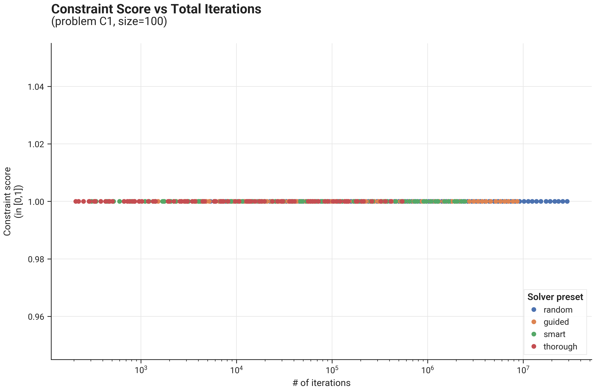
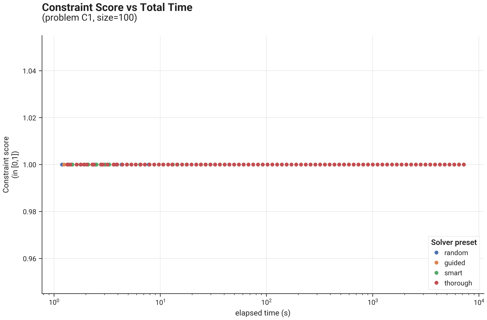
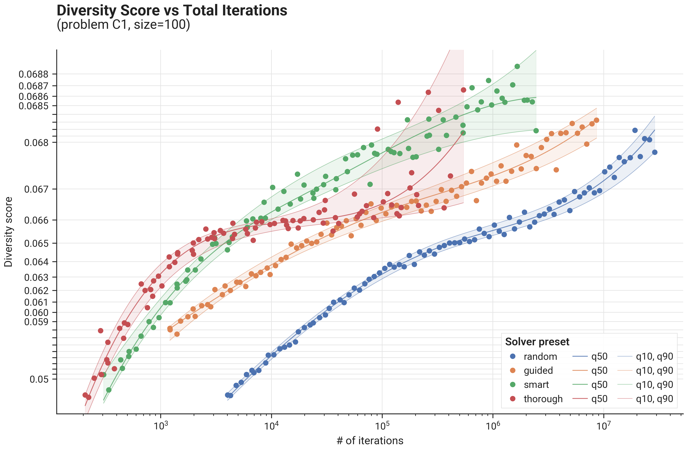
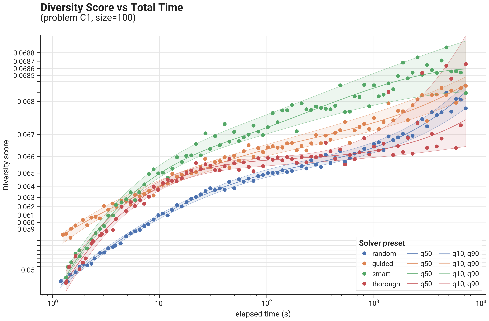

# Benchmark Results - Problem C1 - Solver Presets

## Introduction

We present result of the different built-in solver presets on problem C1, size=100.  We run each preset for exponentially
increasing durations and evaluate final constraint & diversity score of the solution.  Each run is performed with a 
different seed, so also the influence of the seed is evaluated.

## Figures

### Constraint scores

{ .center75 }
{ .center75 }

### Diversity scores

{ .center75 }
{ .center75 }

