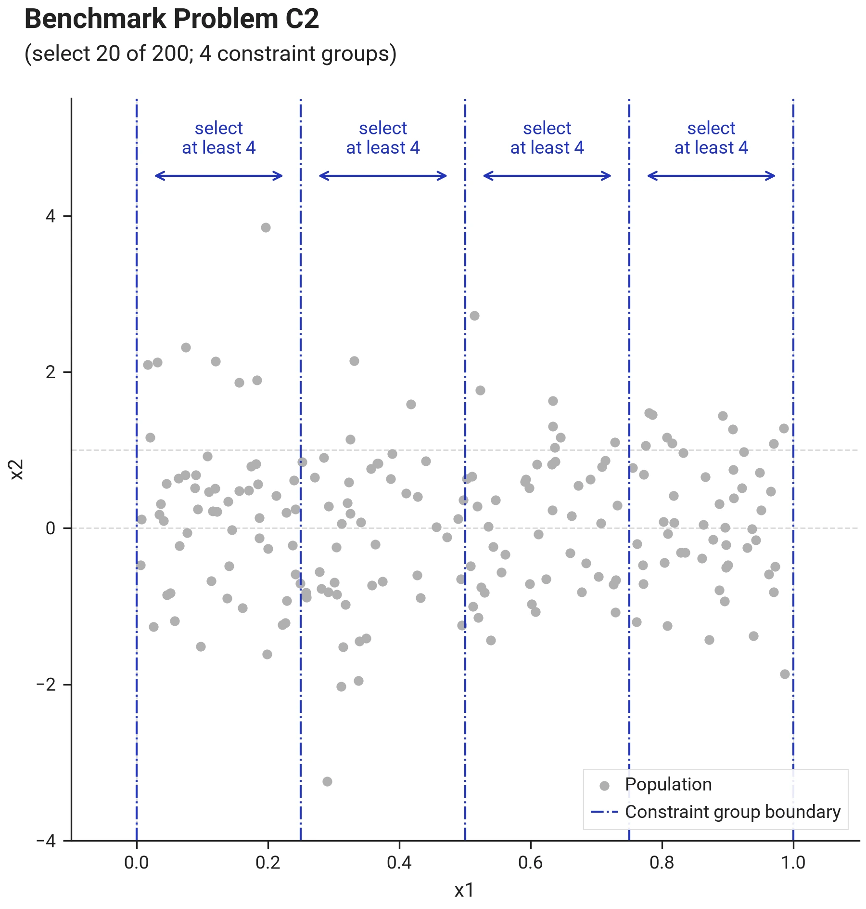
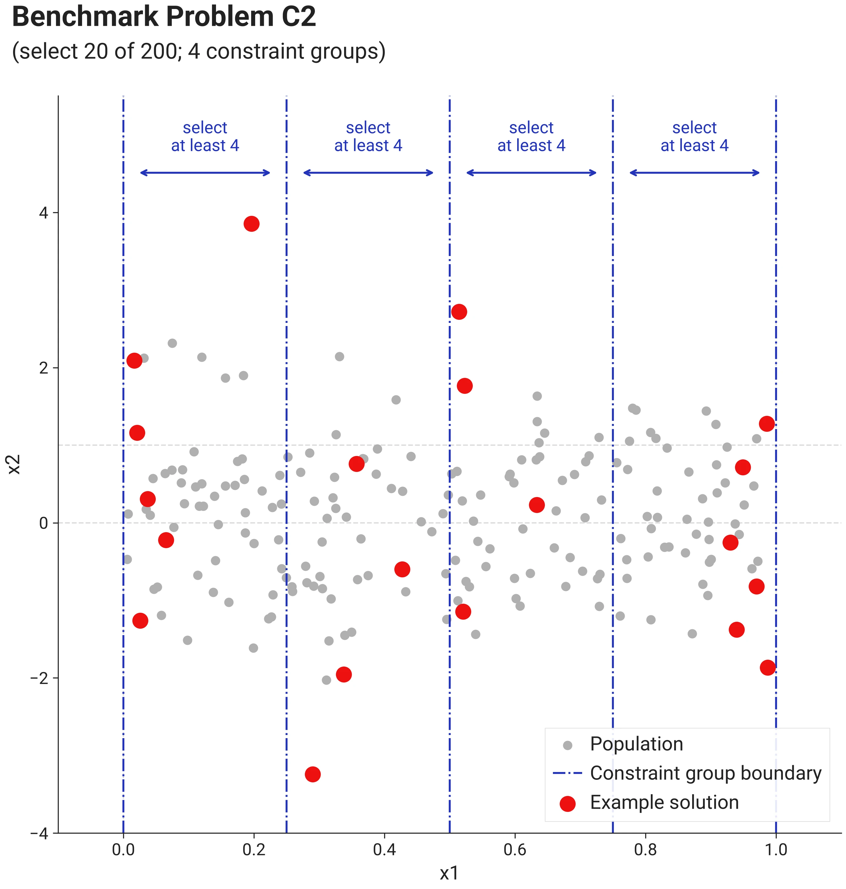
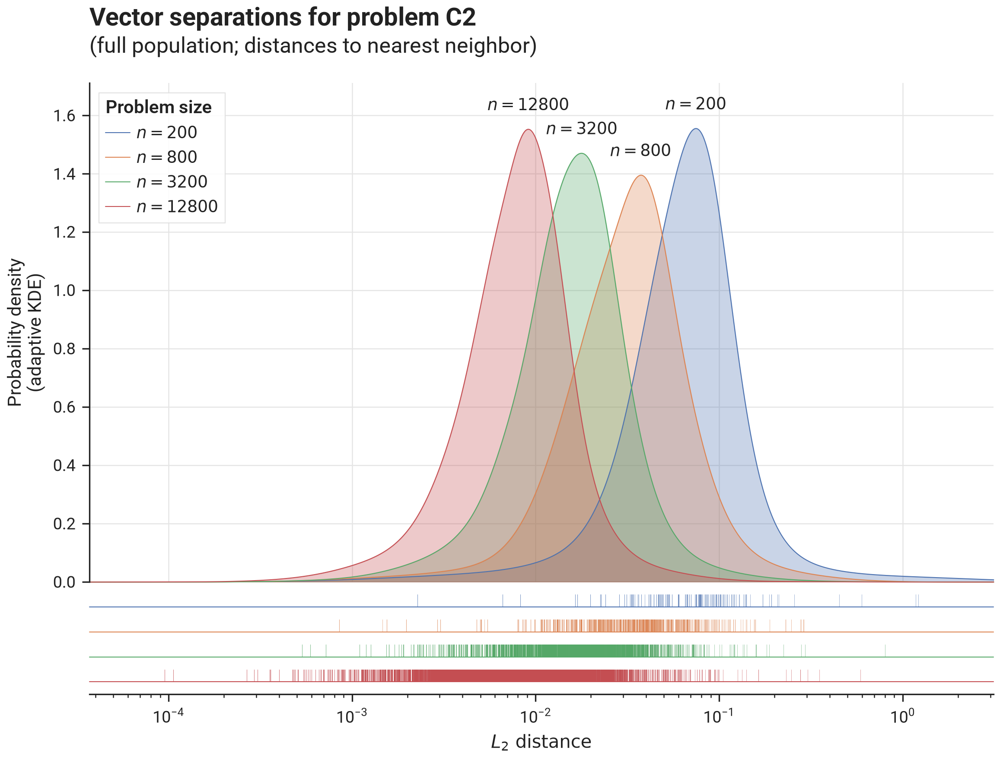

# Benchmark Results - Problem C2

## I. Problem Description

### A. Overall Approach

Identical to test problem `C1`, but with group constraint boundaries changed from $[4, k]$ to $[5,5]$.

### B. Visualization

This image shows problem C2 with size parameter $s=2$ (thus $d=2$, $n=200$, $k=20$, $m=4$):

{ .center }

The image below shows an example solution, obtained by using the `DEFAULT` solver preset over 10.000 iterations
using the L2 distance metric and the `geomean_separation` diversity metric:

{ .center }

### C. Separation statistics

The image below shows distribution of vector separations (distances to nearest neighbor for all vectors in the population),
for different problem sizes:

{ .center75 }

## II. Benchmark results

- [Initialization Strategies](bm_problem_c2_init.md)
- [Optimization Strategies](bm_problem_c2_optim.md)
- [Solver Presets](bm_problem_c2_presets.md)
