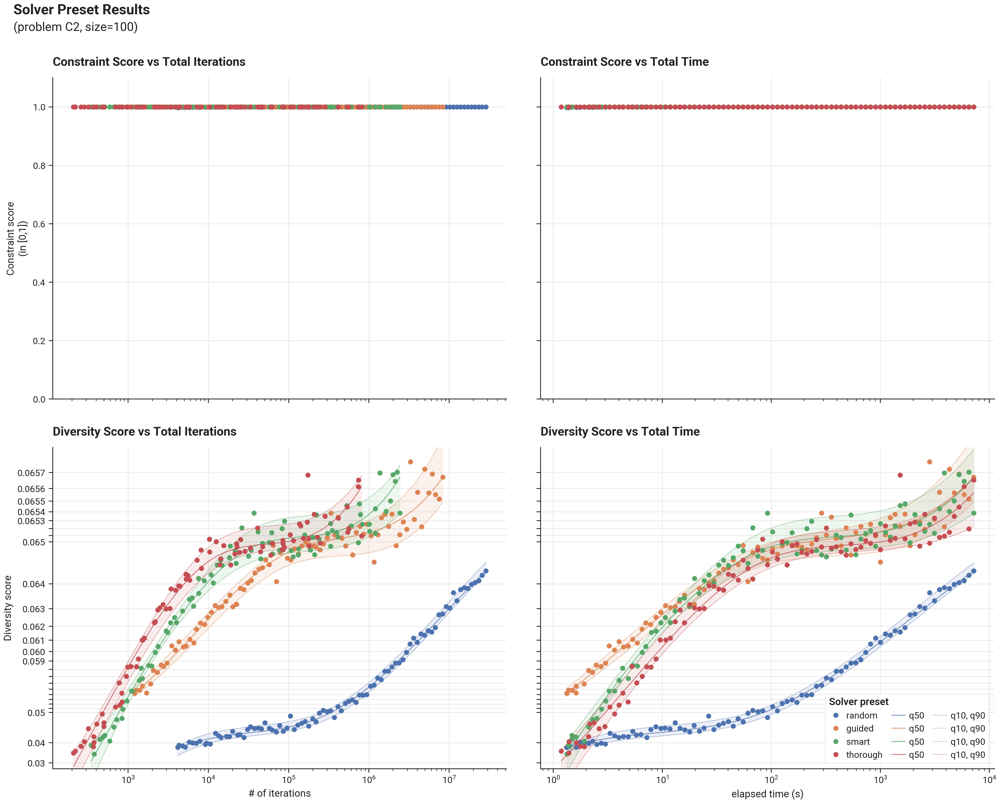

# Benchmark Results - Problem C2 - Solver Presets

## Introduction

We present results of the different built-in solver presets on problem C2, size=100.  We run each preset for
increasing durations and evaluate final constraint & diversity score of the solution.  Each run is performed with a 
different seed, so also the influence of the seed is evaluated.

As the different seeds cause some randomness in the results, we estimate q10-q90 uncertainty bounds, by performing
quantile regression through the data points of each preset using a cubic spline with monotonicity constraints.

The resulting uncertainty bounds give an idea of the result that can be expected by e.g. taking the best result out of 10 runs 
(with different seeds) as this is expected to lie around ~q90.  Uncertainty bounds are only estimated and shown
for the relevant metric (constraint score if the problem is constrained and infeasible; diversity score otherwise)

## Results

