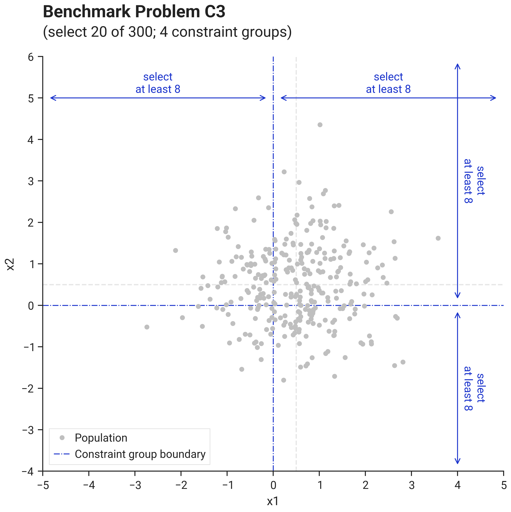
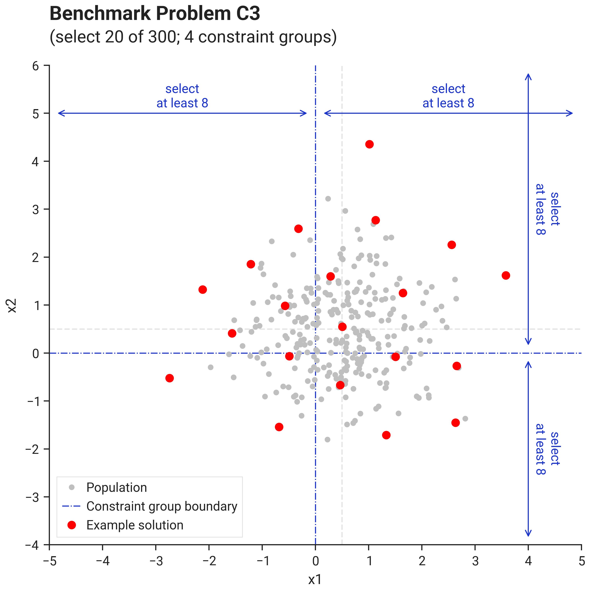
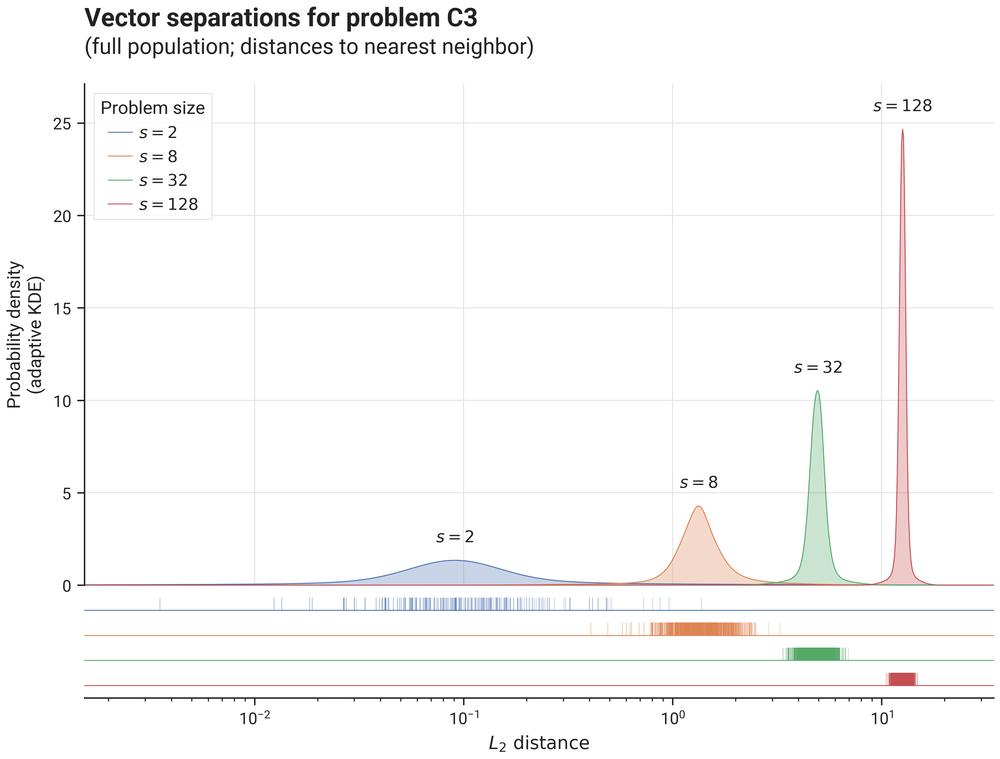

# Benchmark Results - Problem C3

## I. Problem Description

### A. Overall Approach

Vector components are drawn from a standard normal distribution $\mathcal{N}(0.5, 1)$, i.e. centered around $0.5$ and therefore have
a probability of approximately $\sim 69\%$ to be positive and $\sim 31\%$ to be negative.

In each of the $d=s$ dimensions, we split the vectors in $2$ groups, based on the sign of that dimension's vector component:

- between $\frac{4}{10}k$ and $k$ vectors with positive component in that dimension need to be selected
- between $\frac{4}{10}k$ and $k$ vectors with negative component in that dimension need to be selected

For example, for $s=2$ ($d=2, n=300$) we expect group sizes of approximately $207$ and $93$ vectors, from each of which $8$ out of $k=20$ vectors need to be sampled.

Note that in a single dimension, groups of that dimension do not overlap, but across dimensions, there is an intricate overlap
between groups, creating $2^d$ possible combinations of group membership, most of which are expected to be empty for large $d$.

### B. Visualization

This image shows problem C3 with size parameter $s=2$ (thus $d=2$, $n=300$, $k=20$, $m=4$):

{ .center }

The image below shows an example solution, obtained by using the `DEFAULT` solver preset over 10.000 iterations 
using the L2 distance metric and the `geomean_separation` diversity metric:

{ .center }

### C. Separation statistics

The image below shows distribution of vector separations (distances to nearest neighbor for all vectors in the population),
for different problem sizes:

{ .center75 }

## II. Benchmark results

- [Initialization Strategies](bm_problem_c3_init.md)
- [Optimization Strategies](bm_problem_c3_optim.md)
- Solver Presets (TODO)
