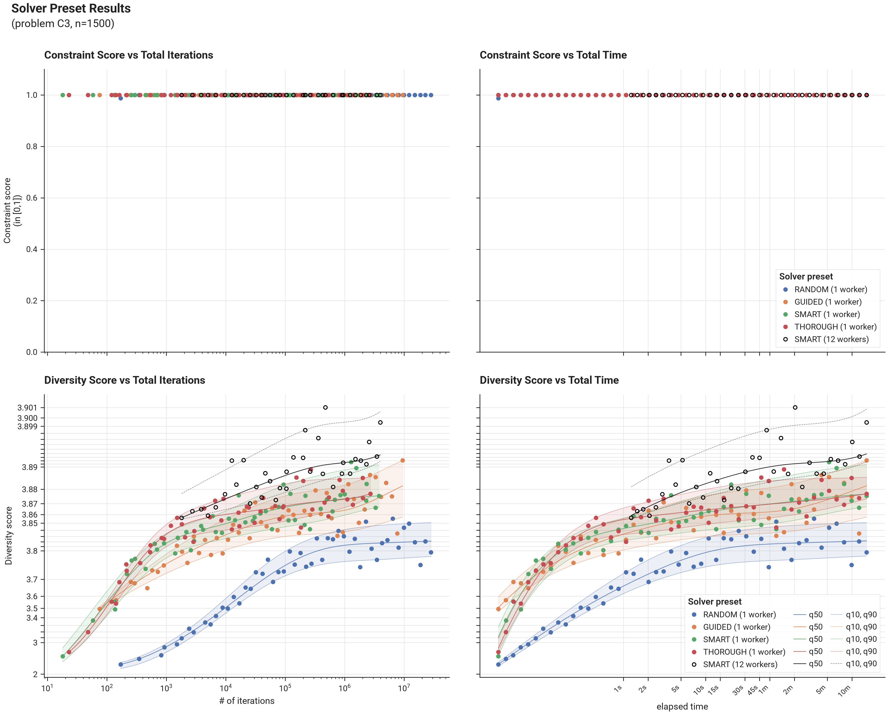

# Benchmark Results - Problem C3 - Solver Presets

## I. Introduction

These results compare the built-in solver presets on problem C3, run at n=1500 — the size at which it selects k=100 items, so every problem's page compares presets at the same selection size. Each preset is run for a ladder of increasing time budgets, with a fresh random seed at every budget point, so the spread across seeds is visible alongside the time trend.

Timing is end-to-end: it includes building the solver's distance store, matching the cost a caller actually pays. The uncertainty band is a q10-q90 estimate from monotone cubic-spline quantile regression through the per-point scatter, approximating the result expected from e.g. the best of ten seeded runs (around q90). The band is shown for the informative metric only — constraint score while a constrained problem is infeasible, diversity score otherwise.

A separate black-circle series shows the default parallel invocation — the SMART preset on the machine's default set of cooperative workers — as a best-of-N reference. It runs only the longer budgets, since a parallel run's start-up cost dominates the shortest ones, and is drawn without a band because it is a single reference series rather than a preset sweep.

## II. Results

### A. Figures

### B. Tables

--8<-- "docs/benchmarks/solver/results/preset_result_quantiles_C3_1500.md"
