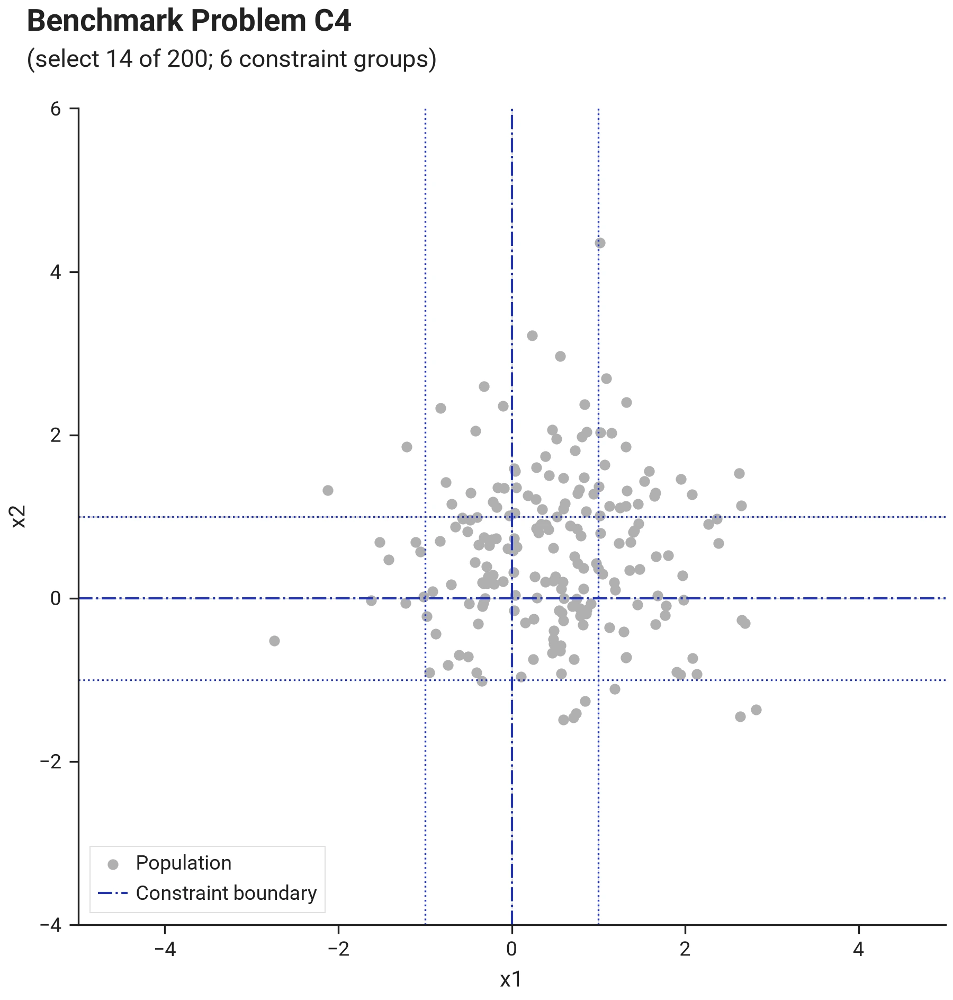
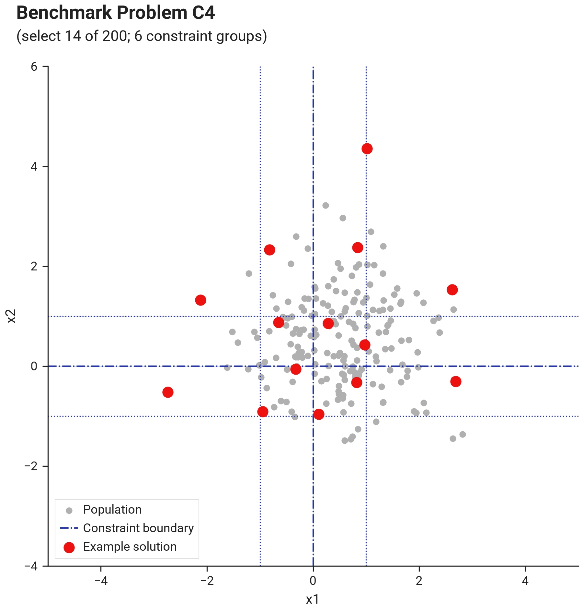
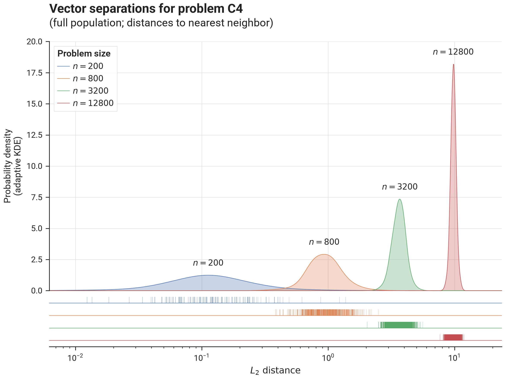

# Benchmark Results - Problem C4

## I. Problem Description

### A. Overall Approach

Vector components are drawn from a standard normal distribution $\mathcal{N}(0.5, 1)$, i.e. centered around $0.5$ and therefore...

- $\sim 69\%$ of values are expected to be positive
- $\sim 31\%$ of values are expected to be negative
- $\sim 62\%$ of values are expected to be in the range $[-1, +1]$

Dimensionality is $d = \lceil n/150 \rceil$ and the selection size is $k = \lceil n/15 \rceil$.  In each of the $d$ dimensions, we define $3$ groups, based on the value of that dimension's vector component:

- between $\frac{4}{10}k$ and $k$ vectors with positive component in that dimension need to be selected
- between $\frac{4}{10}k$ and $k$ vectors with negative component in that dimension need to be selected
- between $\frac{7}{10}k$ and $k$ vectors with component in the range $[-1, +1]$ in that dimension need to be selected

Note that in this example, we also have overlapping groups within a single dimension, as well as across dimensions,
creating $4^d$ possible combinations of group membership.

### B. Visualization

This image shows problem C4 with $n=200$ (thus $d=2$, $k=14$, $m=6$):

{ .center }

The image below shows an example solution, obtained by using the `DEFAULT` solver preset over 10.000 iterations
using the L2 distance metric and the `geomean_separation` diversity metric:

{ .center }

### C. Separation statistics

The image below shows distribution of vector separations (distances to nearest neighbor for all vectors in the population),
for different problem sizes:

{ .center75 }

### D. Feasibility

--8<-- "docs/benchmarks/solver/results/note_measured_feasibility.md"

--8<-- "docs/benchmarks/solver/results/note_feasibility_methodology.md"

See [Proving Feasibility](../../concepts/feasibility.md) for the machinery behind these verdicts, and [Scoring](../../concepts/scoring.md) for the constraints-score scale.

--8<-- "docs/benchmarks/solver/results/feasibility_verdicts_C4.md"

## II. Benchmark results

- [Initialization Strategies](bm_problem_c4_init.md)
- [Optimization Strategies](bm_problem_c4_optim.md)
- [Solver Presets](bm_problem_c4_presets.md)
