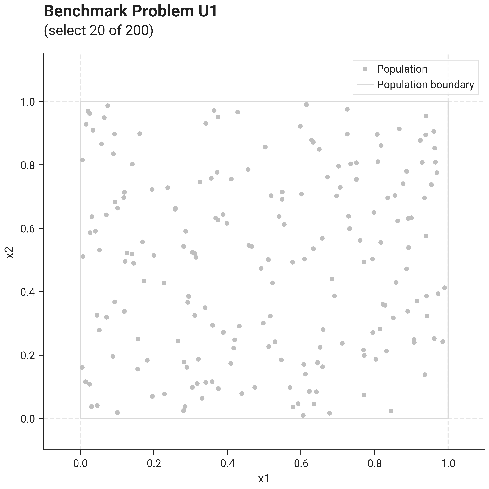
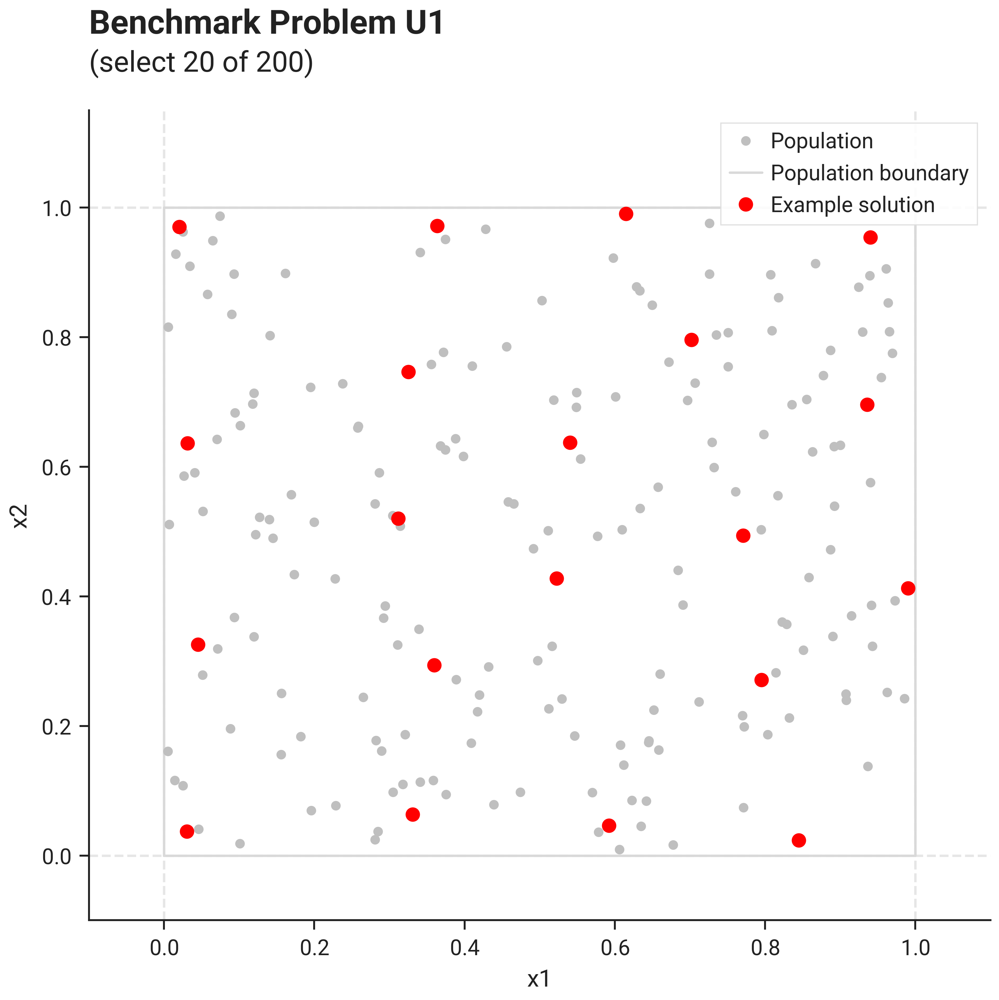
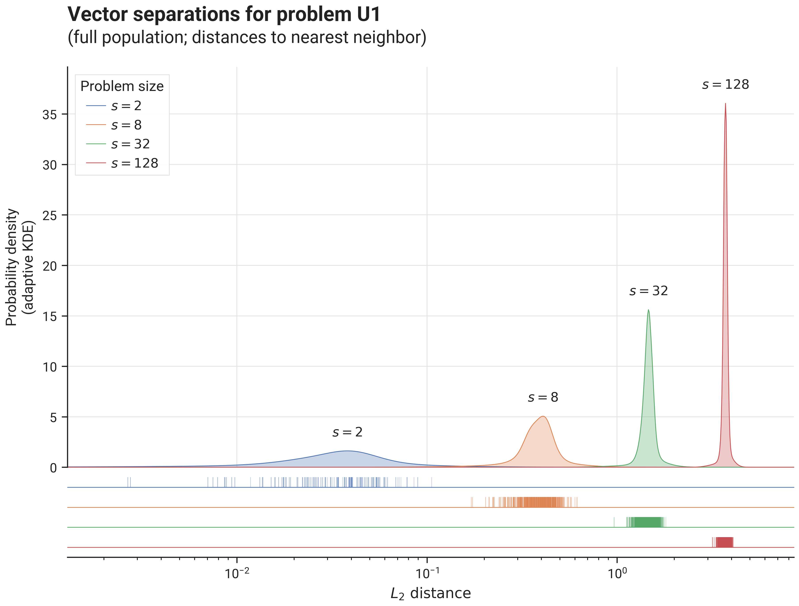

# Benchmark Results - Problem U1

## I. Problem Description

### A. Overall Approach

Vectors are drawn from a uniform distribution over $[0, 1]^d$.

### B. Visualization

This image shows problem U1 with size parameter $s=2$ (thus $d=2$, $n=200$, $k=20$, $m=0$):

{ .center }

The image below shows an example solution, obtained by using the `DEFAULT` solver preset over 10.000 iterations 
using the L2 distance metric and the `geomean_separation` diversity metric:

{ .center }

### C. Separation statistics

The image below shows distribution of vector separations (distances to nearest neighbor for all vectors in the population),
for different problem sizes:

{ .center75 }

## II. Benchmark results

- [Initialization Strategies](bm_problem_u1_init.md)
- [Optimization Strategies](bm_problem_u1_optim.md)
- [Solver Presets](bm_problem_u1_presets.md)
