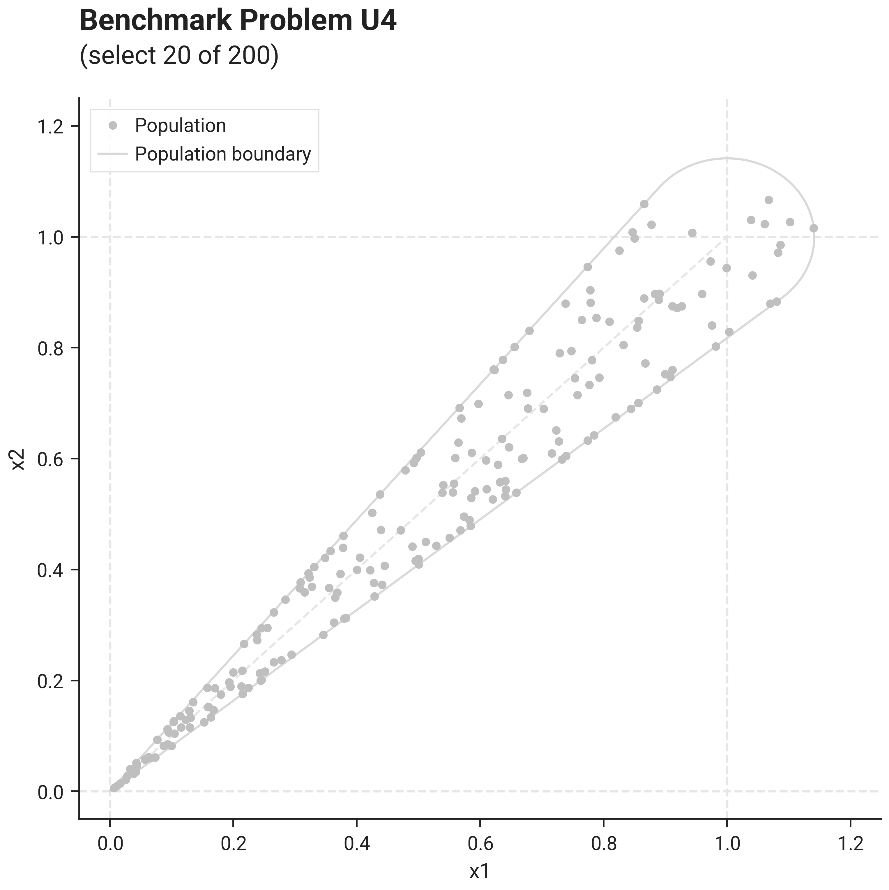
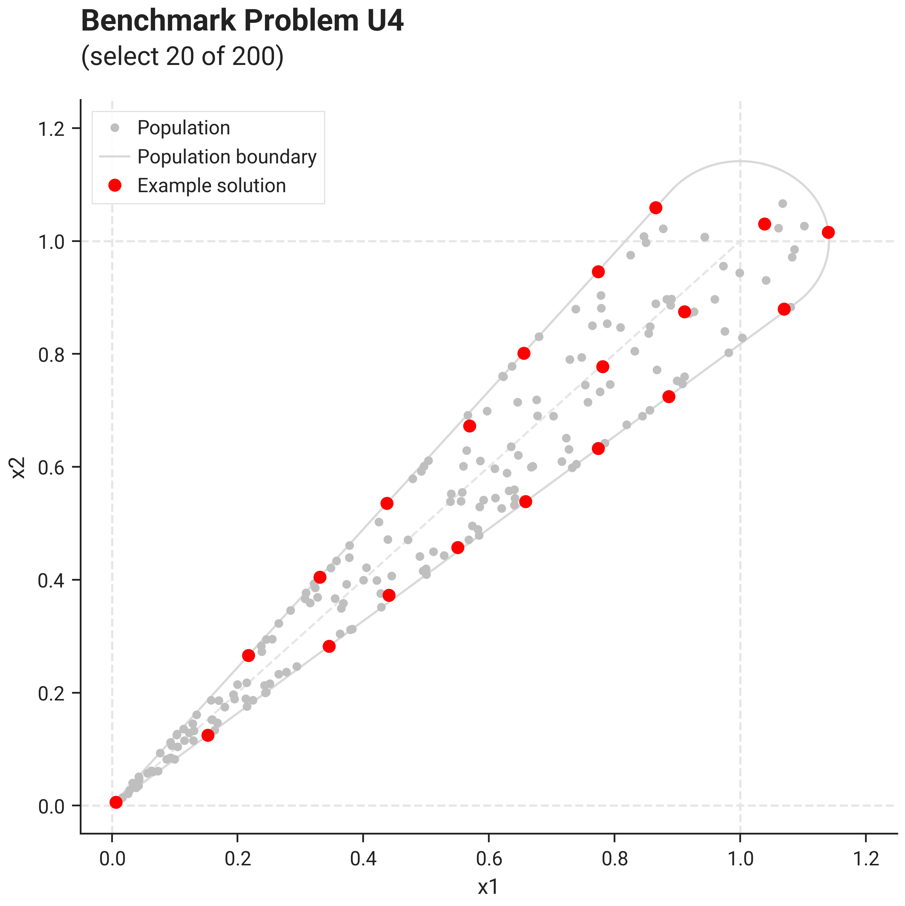
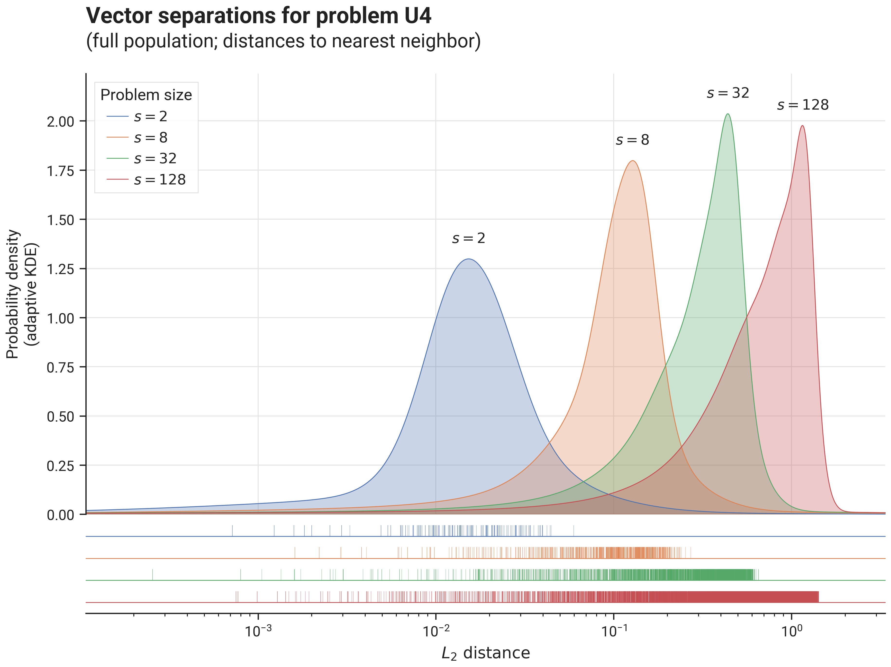

# Benchmark Results - Problem U4

## I. Problem Description

### A. Overall Approach

Samples are drawn in a cone-shaped region around the line spanning $(0,0,\ldots,0) \in \mathbb{R}^d$ to $(1,1,\ldots,1) \in \mathbb{R}^d$, where each sample is constructed as follows:

- determine radius $r = \frac{1}{10}\sqrt{d}$   (ensuring a cone with constant angular width as $d$ increases)
- choose a point randomly at a distance $r$ from $(1,1,\ldots,1) \in \mathbb{R}^d$ in a random direction
- scale point (component-wise) with scaling factor $c$ drawn from a uniform distribution over $[0, 1]$

### B. Visualization

This image shows problem U4 with size parameter $s=2$ (thus $d=2$, $n=200$, $k=20$, $m=0$):

{ .center }

The image below shows an example solution, obtained by using the `DEFAULT` solver preset over 10.000 iterations 
using the L2 distance metric and the `geomean_separation` diversity metric:

{ .center }

### C. Separation statistics

The image below shows distribution of vector separations (distances to nearest neighbor for all vectors in the population),
for different problem sizes:

{ .center75 }

## II. Benchmark results

- [Initialization Strategies](bm_problem_u4_init.md)
- [Optimization Strategies](bm_problem_u4_optim.md)
- [Solver Presets](bm_problem_u4_presets.md)
