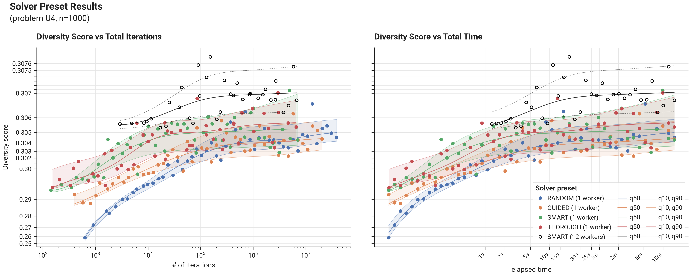

# Benchmark Results - Problem U4 - Solver Presets

## I. Introduction

These results compare the built-in solver presets on problem U4 at n=1000 — the size at which the problem selects k=100 items, so every page compares presets at the same selection size.

--8<-- "docs/benchmarks/solver/results/note_preset_methodology.md"

## II. Results

### A. Figures

### B. Tables

--8<-- "docs/benchmarks/solver/results/preset_result_quantiles_U4_1000.md"
