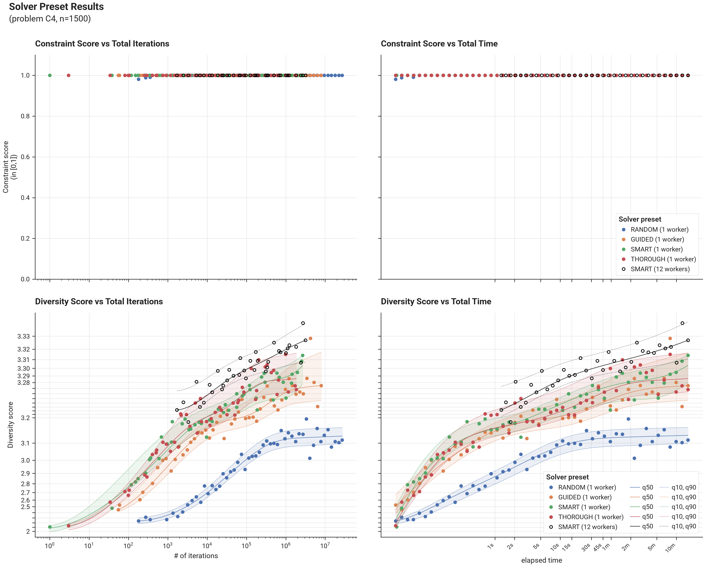

# Benchmark Results - Problem C4 - Solver Presets

See [Problem C4](problem_c4.md) for the problem definition.

--8<-- "docs/benchmarks/solver/results/note_measured_presets_constrained.md"

## I. Introduction

These results compare the built-in solver presets on problem C4 at n=1500 — the size at which the problem selects k=100 items, so every page compares presets at the same selection size.

--8<-- "docs/benchmarks/solver/results/note_preset_methodology_constrained.md"

## II. Results

### A. Figures

### B. Tables

--8<-- "docs/benchmarks/solver/results/preset_result_quantiles_C4_1500.md"
