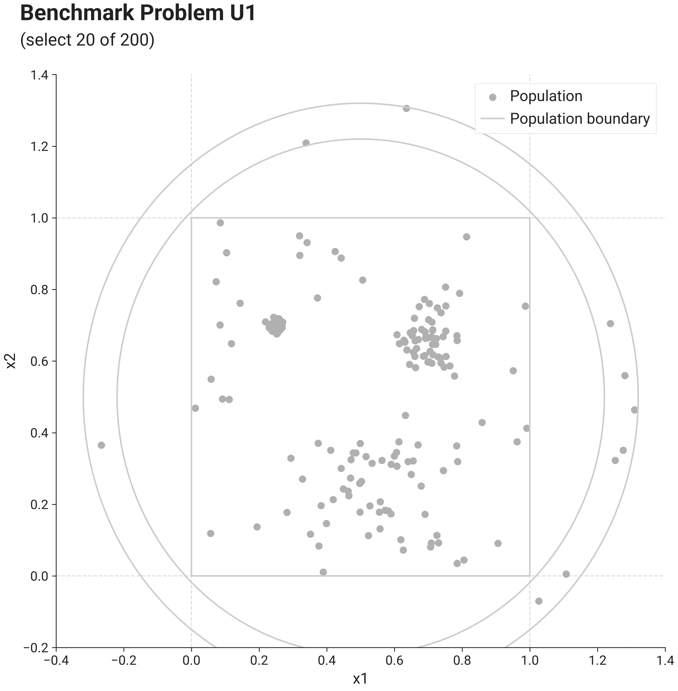
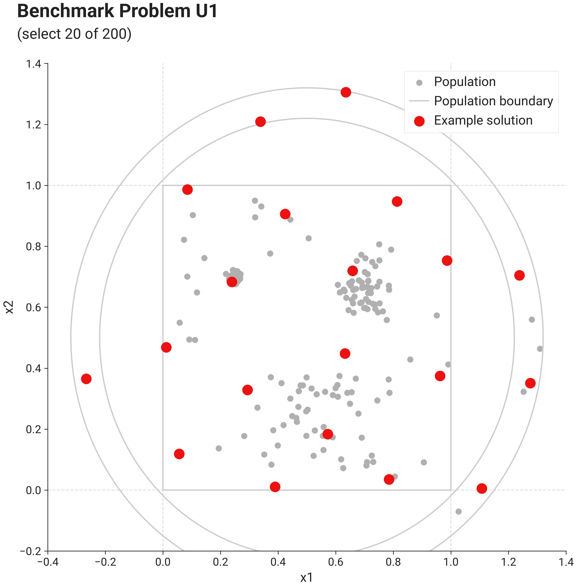
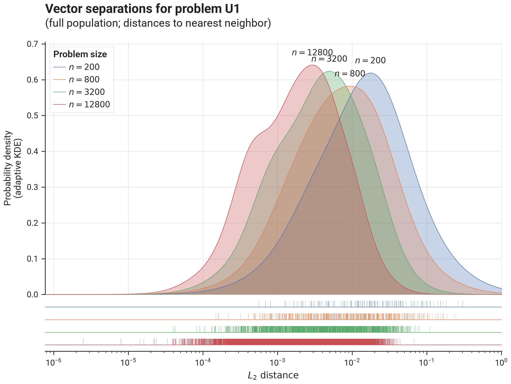

# Benchmark Results - Problem U1

## I. Problem Description

### A. Overall Approach

`U1` is the suite's **reference problem for cross-tool comparisons**: fixed at $d=2$ so every third-party subset-selection tool can run it, with a geometry chosen to make solver-quality differences clearly visible. Vectors form a mixture with fixed proportions of $n$:

- **three gaussian clusters** with equal point counts and spreads in ratio $\sim$ 1:4:9 ($75\%$ of points) — the same number of points in very different volumes, so a diversity-aware selection must allocate against point count, not spatial extent,
- a **uniform background** over the unit square ($20\%$),
- a **sparse halo of far outliers** on a ring outside the unit square ($5\%$) — the classic trap for one-shot farthest-point greedy selection, which spends its opening picks there.

Because the proportions are fixed, the density structure is independent of $n$: growing the problem yields the same picture, denser.

### B. Visualization

This image shows problem U1 with $n=200$ (thus $d=2$, $k=20$, $m=0$):

{ .center }

The image below shows an example solution, obtained by using the `DEFAULT` solver preset over 10.000 iterations
using the L2 distance metric and the `geomean_separation` diversity metric:

{ .center }

### C. Separation statistics

The image below shows distribution of vector separations (distances to nearest neighbor for all vectors in the population),
for different problem sizes:

{ .center75 }

## II. Benchmark results

- [Init Strategies](init_u1.md)
- [Optim Strategies](optim_u1.md)
- [Solver Presets](presets_u1.md)
