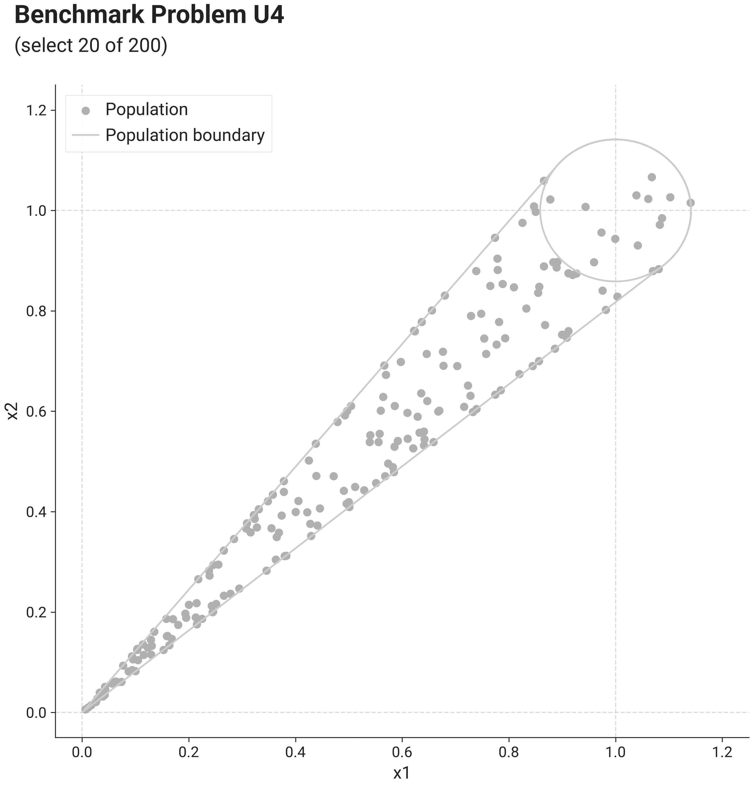
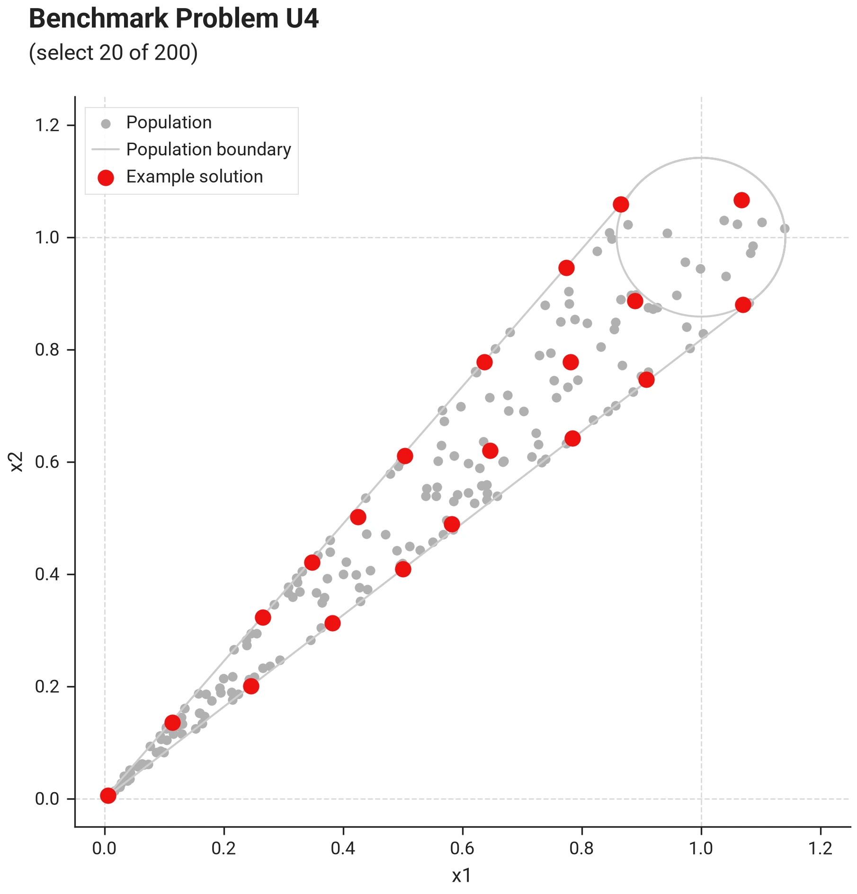
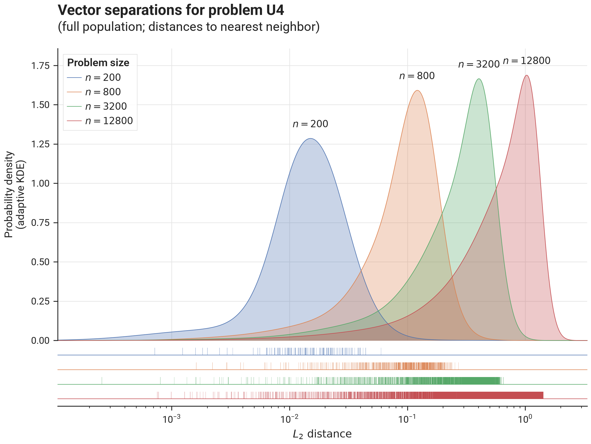

# Benchmark Results - Problem U4

## I. Problem Description

### A. Overall Approach

Samples are drawn in a cone-shaped region around the line spanning $(0,0,\ldots,0) \in \mathbb{R}^d$ to $(1,1,\ldots,1) \in \mathbb{R}^d$, with $d = \lceil n/100 \rceil$, where each sample is constructed as follows:

- determine radius $r = \frac{1}{10}\sqrt{d}$   (ensuring a cone with constant angular width as $d$ increases)
- choose a point randomly at a distance $r$ from $(1,1,\ldots,1) \in \mathbb{R}^d$ in a random direction
- scale point (component-wise) with scaling factor $c$ drawn from a uniform distribution over $[0, 1]$

Because points are placed uniformly along the cone axis while the cone's cross-section volume grows like $c^{d-1}$, the volumetric density concentration toward the cone's tip sharpens exponentially with $d$ — the most extreme density regime in the suite.

### B. Visualization

This image shows problem U4 with $n=200$ (thus $d=2$, $k=20$, $m=0$):

{ .center }

The image below shows an example solution, obtained by using the `DEFAULT` solver preset over 10.000 iterations
using the L2 distance metric and the `geomean_separation` diversity metric:

{ .center }

### C. Separation statistics

The image below shows distribution of vector separations (distances to nearest neighbor for all vectors in the population),
for different problem sizes:

{ .center75 }

## II. Benchmark results

- [Init Strategies](init_u4.md)
- [Optim Strategies](optim_u4.md)
- [Solver Presets](presets_u4.md)
