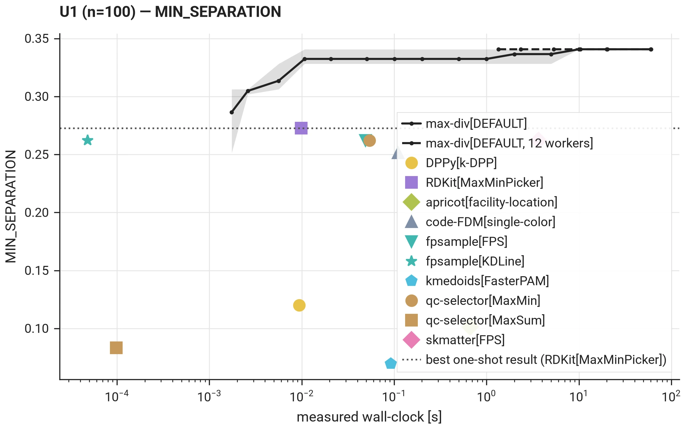
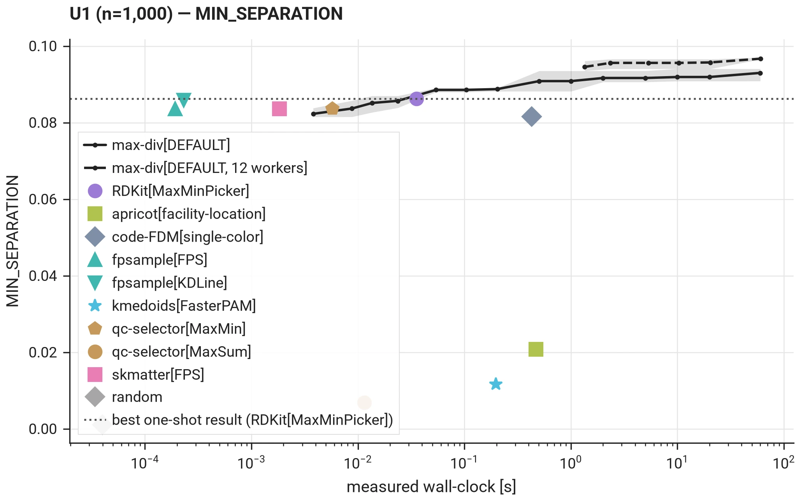
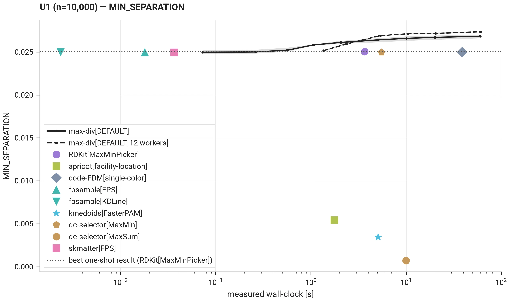
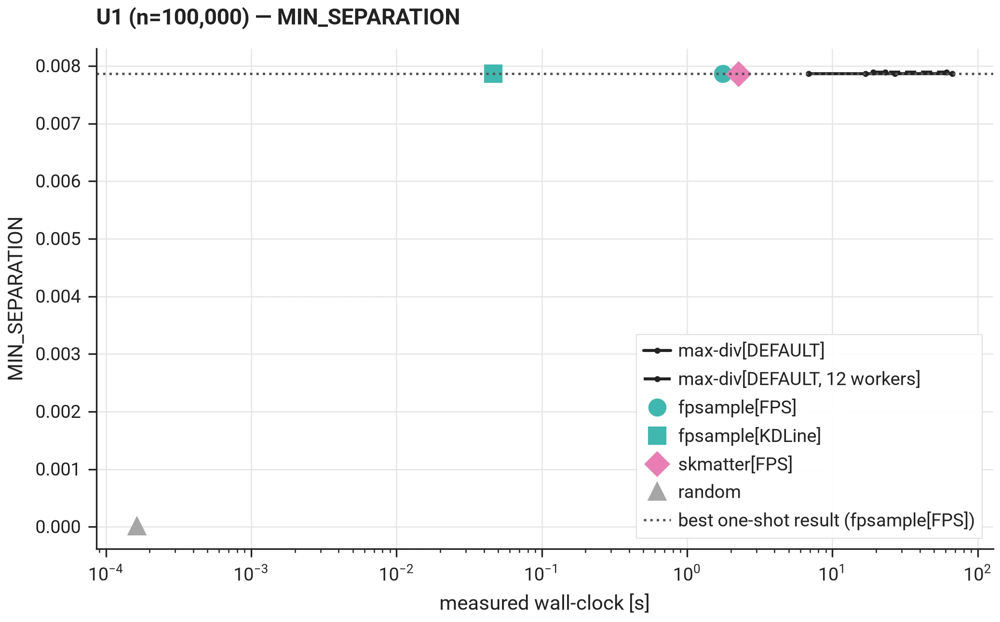

# Head-to-Head — vs. Python Heuristics

## I. Goal and reading guide

The [scaling pages](../scaling/protocol.md) say how large a problem each Python subset-selection tool handles, and at what quality. This page adds what they cannot show: how `max-div`'s quality evolves with its time budget next to the fixed answer of each one-shot tool. Two questions per size:

- at what budget does `max-div` pass the best one-shot tool?
- how do `max-div`'s single-worker and 12-worker series compare?

Every chart reads the same way:

- the **black curves** are `max-div`: solid with one worker, dashed with 12; the band around each is the min/max over seeds, the line the mean;
- each **dot** is one one-shot tool at its own measured time and quality (mean over seeds);
- the **dotted horizontal line** is the best one-shot result at that size — where a black curve crosses it is the budget at which `max-div` overtakes.

## II. Protocol

The tier follows the [solver-scaling protocol](../scaling/protocol.md): its time budget, reference machine, and its [solver configurations](../scaling/solver_configs.md) for the one-shot tools. The tier runs 3 seeds per cell, not 5 ([why](../scaling/protocol.md#iii-fundamental-constants-invariants)).

- **Problem**: U1 — the scaling pages' problem, so both describe the same instances — at n = 100, 1,000, 10,000 and 100,000, k = n/10. Constrained problems are not on this page: no one-shot tool in the registry handles the constraints the harder problems carry.
- **Objective**: minimum separation under the `L2` distance, scored identically for every tool by `max-div`'s own metric code. Tools that optimize a different objective enter as different-objective references, not as dispersion competitors ([solver configurations](../scaling/solver_configs.md)):
    - `apricot-select` (facility location);
    - `kmedoids` (representativeness);
    - `DPPy` (a determinantal sample);
    - the max-sum picker of `qc-selector`.
- **Entrants**: every non-exact registry tool, at the sizes its scaling time limit covers; one run per seed where the tool is seeded. A tool's time includes any conversion it needs. Exact solvers are compared on the [exact-solver tier](tier1.md), not here.
- **max-div**: `DEFAULT` preset, one independent solve per budget and seed, one solve at a time, timed end to end around the call; charts plot *measured* wall-clock, never the nominal budget. Two budget series per size:
    - one worker, 1 ms to 60 s;
    - 12 workers with the default dynamic grouping, 1 s to 60 s.

## III. Results

The best one-shot tool is a farthest-point picker at every size: `RDKit` up to n = 10,000, `fpsample` at n = 100,000, where the other pickers reach the same value within 0.5 %. `max-div`'s `DEFAULT` preset starts from the same farthest-point construction, so the comparison is about what its optimization adds on top, and at what fixed cost:

- **n ≤ 1,000**: `max-div` passes the best picker within 50 ms and keeps improving to 60 s — at n = 100 up to the [certified optimum](tier1.md), at n = 1,000 to 9 % (one worker) and 12 % (12 workers) above the picker.
- **n = 10,000**: `max-div`'s first budgets sit 0.3 % below the picker line, the optimization overtakes at 0.5 s, and at 60 s the series end 8 % (one worker) and 9 % (12 workers) above it. The picker itself takes 2 ms (`fpsample[KDLine]`) to 4 s (`RDKit`) for its one answer.
- **n = 100,000**: no measurable gain. Every series and every picker sit at the same value; `max-div`'s single-worker series costs a fixed 7 s before its first result and the 12-worker series 18 s, against 50 ms for `fpsample[KDLine]`. At this size a farthest-point picker is the better answer.

The [tables page](tier2_tables.md) holds the overtake budgets and every entrant's quality and time.

### III.A. n = 100

### III.B. n = 1,000

### III.C. n = 10,000

### III.D. n = 100,000

