# Head-to-Head — vs. MDPLIB Best-Known Values

## I. Goal and reading guide

This tier is the only one run on instances `max-div` did not generate: the MMDP instance sets of the [MDPLIB library](https://www.uv.es/rmarti/paper/mdp.html) (Glover, Geo, Ran), the literature's shared max-min diversity benchmark. The question is external validity — how far `max-div` is from the best value anyone has published per instance, as a function of budget, and where it matches or exceeds that value.

Every chart covers one instance group (a set, a size n and a selection size k, ten instances) and reads the same way:

- the **y axis** is the gap to the best-known value in percent, positive below it; the **dotted line** at zero is the best-known value itself;
- the **black curves** are `max-div`: solid with one worker, dashed with 12 (n = 500 only); the line is the mean over the group's instances and seeds, the band the min/max;
- each **dot** is one one-shot tool at its own measured time and mean gap.

The numbers behind the charts are on the [tables page](tier3_tables.md).

## II. Protocol

The tier follows the [solver-scaling protocol](../scaling/protocol.md) where the two overlap: T_max of 60 s, the [solver configurations](../scaling/solver_configs.md), the reference machine (Apple M3 Max, 12 performance cores), and 3 seeds per cell, not the scaling protocol's 5, so that the three head-to-head tiers fit one night of measurement.

### II.A. Instances, entrants and budgets

- **Instances**: the 120 published (instance, k) pairings of the Geo and Ran sets — n ∈ {100, 250, 500}, two k values per n, ten instances each.
    - Geo instances come with coordinates (d = 5 at n = 100, d = 13 at n = 250 and 500); Ran instances are given as a distance matrix only.
    - The 75 Glover pairings (n ≤ 30) are measured but not charted: one sentence on the tables page states the match count.
    - Instances are fetched at run time and never redistributed; the maintainers' site states no license ("all rights reserved") and asks that the library be cited as Martí, Duarte, Martínez-Gavara & Sánchez-Oro (2021), *The MDPLIB 2.0 Library of Benchmark Instances for Diversity Problems*.
- **Objective**: minimum separation, the MMDP objective, scored identically for every tool.
- **Entrants**: the registry tools whose input form the instance provides. On Ran, the tools that accept a distance matrix: `qc-selector` (max-min and max-sum), `kmedoids`. On Geo, additionally the tools that take vectors: `fpsample`, `skmatter`, `RDKit`, `apricot-select`, `DPPy`, `code-FDM`. Exact solvers are the [exact-solver tier](tier1.md)'s. One run per seed where the tool is seeded; a tool's time includes any conversion it needs.
- **max-div**: `DEFAULT` preset, the single-worker budget series from 1 ms to 60 s on every pairing; the 12-worker series from 1 s to 60 s on the n = 500 pairings only, the smaller ones plateau within milliseconds. One independent solve per budget and seed, timed end to end; charts plot measured wall-clock.

### II.B. Reference values

The best-known value of a pairing is the largest value published by any of three sources; the tables page lists every value with its source.

- **RMGD2010** — Resende, Martí, Gallego & Duarte (2010), *GRASP and path relinking for the max–min diversity problem*, Computers & Operations Research 37(3): the values distributed with the instances, best over the paper's six algorithms.
- **PHG2011** — Porumbel, Hao & Glover (2011), *A simple and effective algorithm for the MaxMin diversity problem*, Annals of Operations Research 186(1), appendix tables 6–7 ([author manuscript](https://cedric.cnam.fr/~porumbed/papers/paperAOR11.pdf)).
- **DCGL2009** — Della Croce, Grosso & Locatelli (2009), *A heuristic approach for the max–min diversity problem based on max-clique*, Computers & Operations Research 36(8), as republished in PHG2011.

The 2010 values alone sit below a later source on 68 of the 120 Geo and Ran pairings, so a comparison against them mostly measures their age.

A value is flagged as a **proven optimum** only where a published exact method certified it:

- every n = 100 pairing (Della Croce et al. 2009, per PHG2011);
- the n = 250 and 500 pairings CPLEX proved in Saboonchi (2013), *Solving the p-dispersion problem*, [HEC Montréal thesis](http://biblos.hec.ca/biblio/theses/2013NO10.PDF), tables 3.V and 3.VI. <!-- codespell:ignore theses -->

That is 93 pairings in all. On those, exceeding the reference is impossible and matching it is the most any method can reach.

Ran's distances are integers in [1, 200], so on that set one integer step is a whole-percent gap at the smaller reference values; the charts show it as a staircase.

## III. Geo

No Geo value is exceeded, and the best-known value is reached on 8 and 6 of the ten n = 100 instances but on one instance per group from n = 250 on.

The remaining gap at 60 s is small: 0.4–2.4 % on average per group with one worker, 0.5–1.2 % with 12 workers at n = 500, the worst instance of a group 1.7–10.5 % short.

The farthest-point pickers (`fpsample`, `skmatter`, `RDKit`, `qc-selector` max-min, `code-FDM`) sit 4–8.5 % short in a few milliseconds; `max-div` passes them within about 100 ms of budget and keeps improving. The tools with a different objective (`apricot-select`, `kmedoids`, `DPPy`, `qc-selector` max-sum) sit 31–49 % short, as expected of an objective that is not max-min.

### III.A. n = 100, k = 10

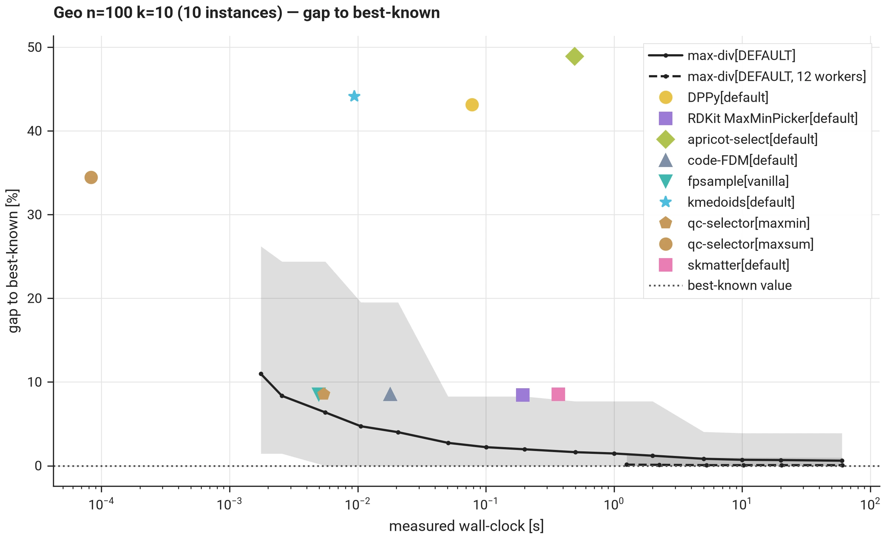

### III.B. n = 100, k = 30

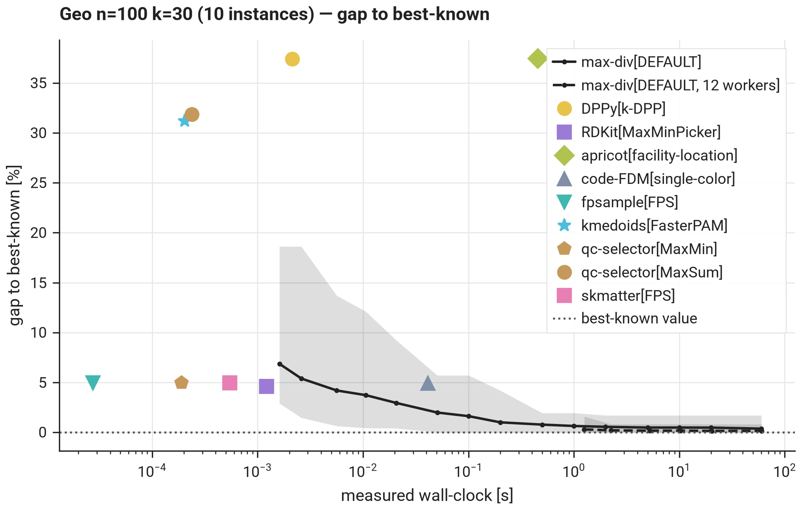

### III.C. n = 250, k = 25

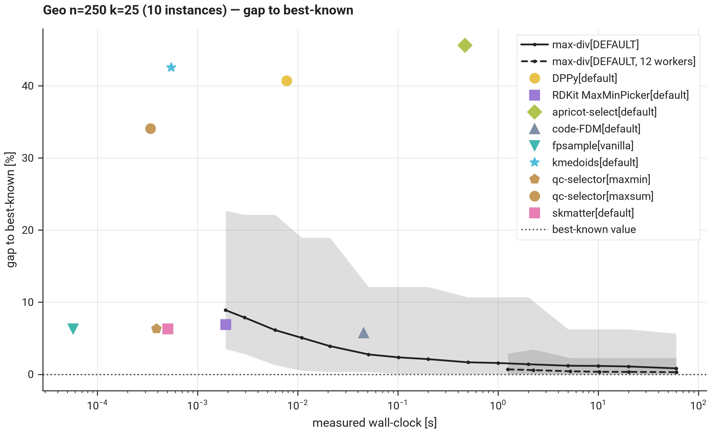

### III.D. n = 250, k = 75

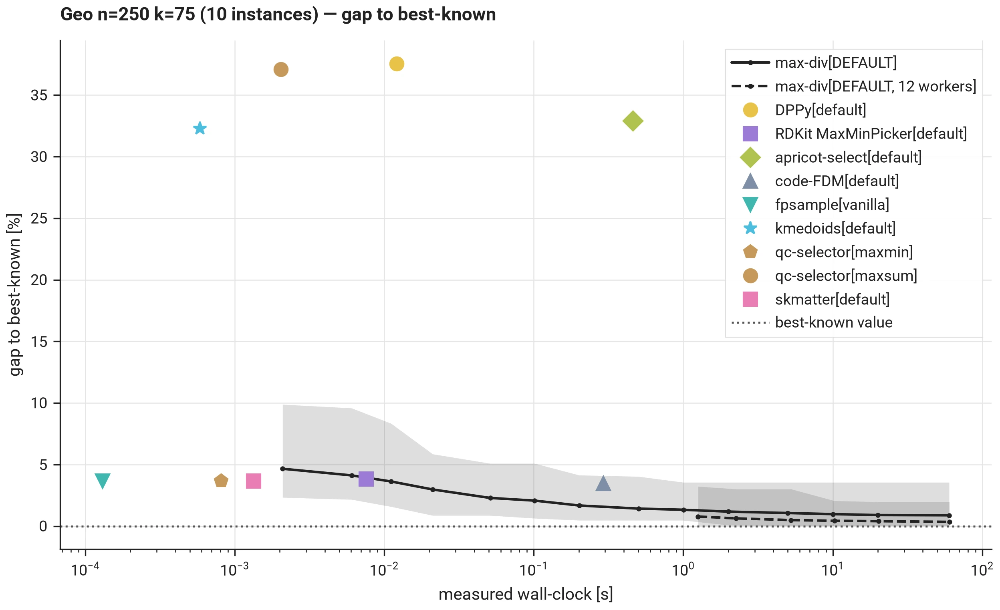

### III.E. n = 500, k = 50

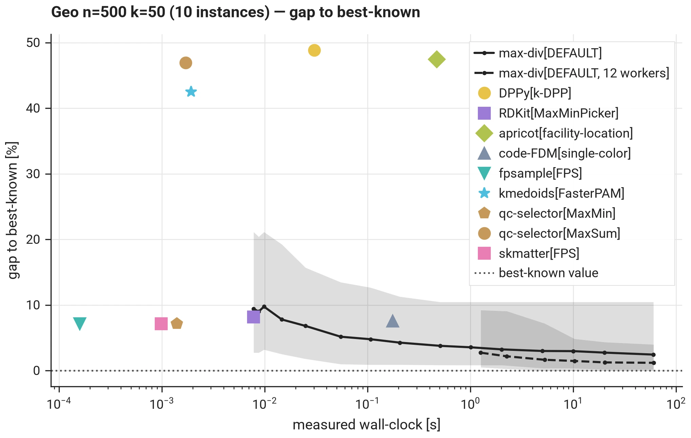

### III.F. n = 500, k = 150

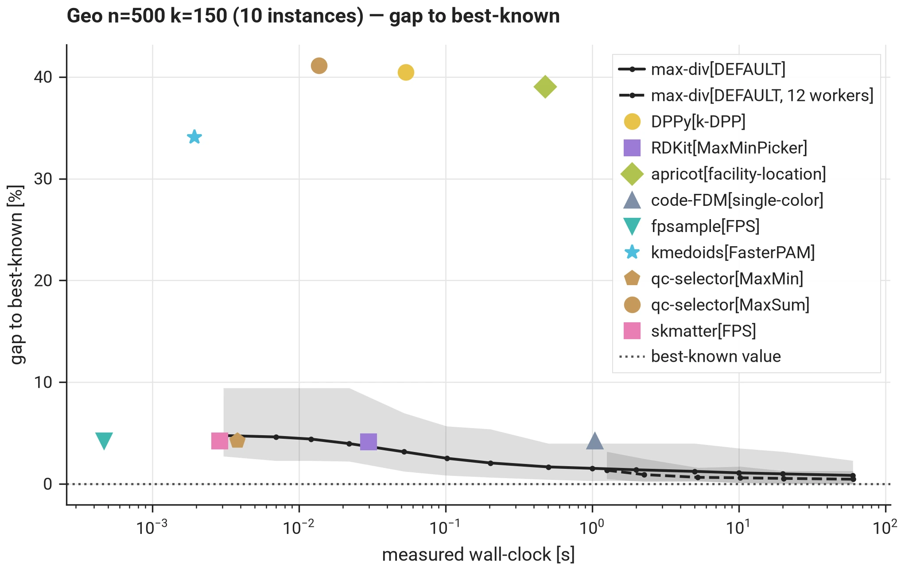

## IV. Ran

The Ran picture is the same, except for one group. At n = 100 the best-known value is reached on 7 and 8 instances; from n = 250 on, on 0–4 per group, never exceeded, with 1.0–3.0 % average gaps at 60 s.

The exception is Ran 500 with k = 150: every best-known value there is 5, `max-div` reaches 4 on every instance with one worker — the integer distances make that one step a 20 % gap — and 12 workers reach 5 on three instances within 60 s.

Only the distance-matrix tools enter: `qc-selector` max-min sits 2–11 % short (39 % on the k = 150 group), `kmedoids` and the max-sum picker 4–31 % (80 % on that group).

### IV.A. n = 100, k = 10

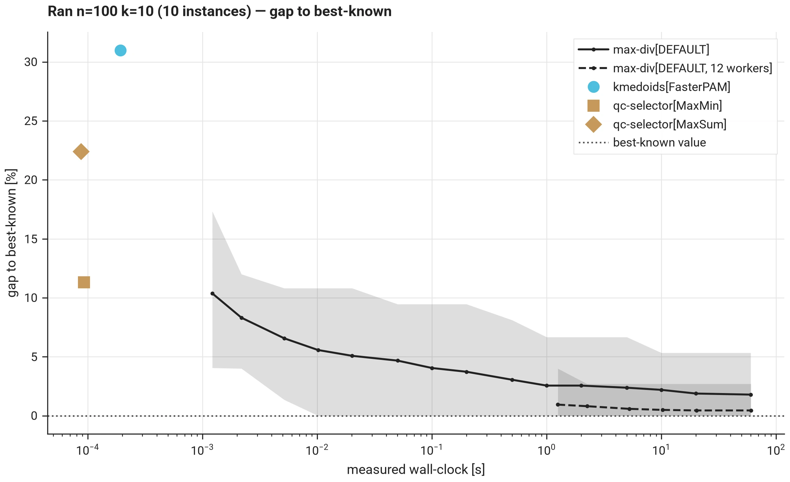

### IV.B. n = 100, k = 30

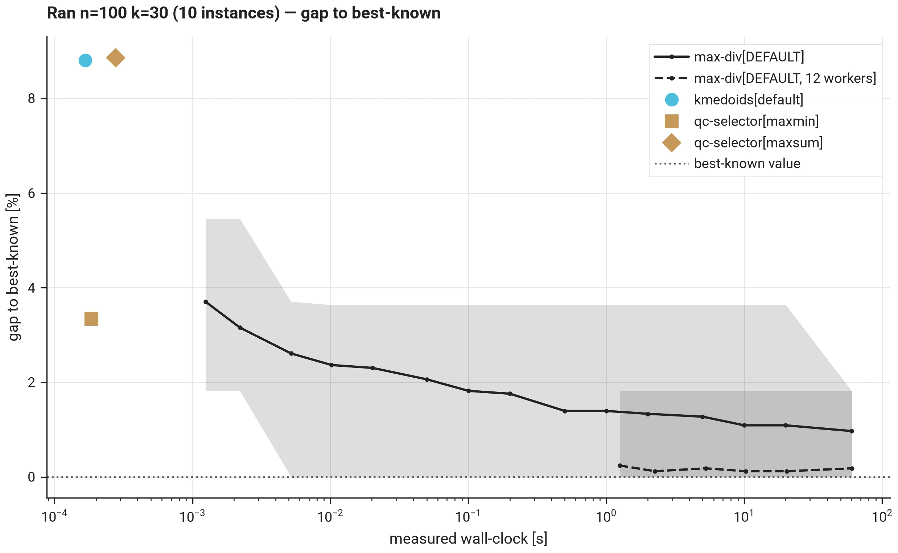

### IV.C. n = 250, k = 25

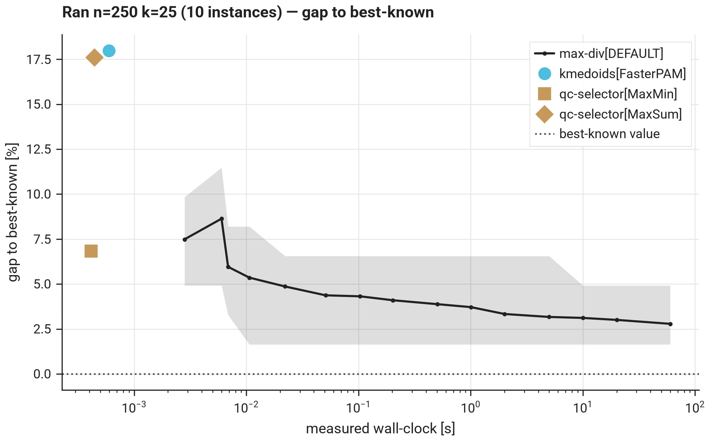

### IV.D. n = 250, k = 75

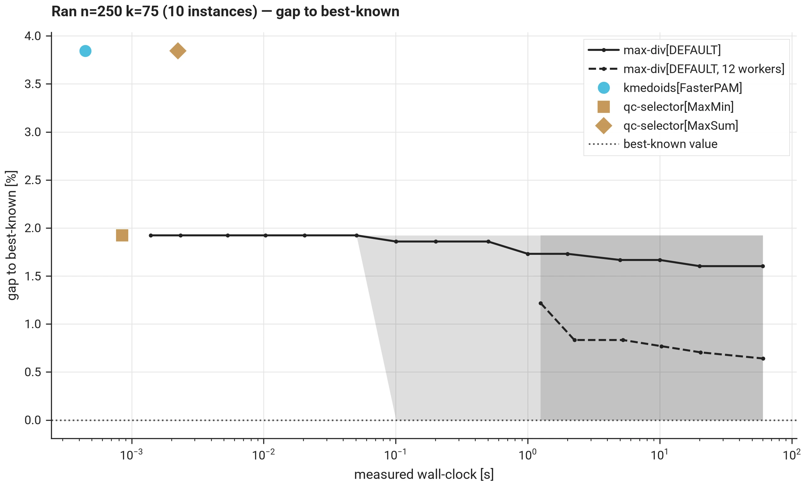

### IV.E. n = 500, k = 50

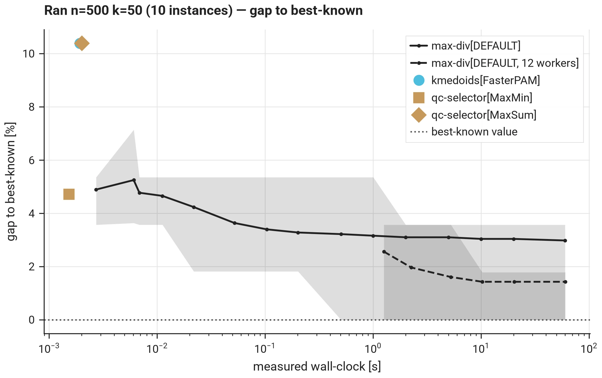

### IV.F. n = 500, k = 150

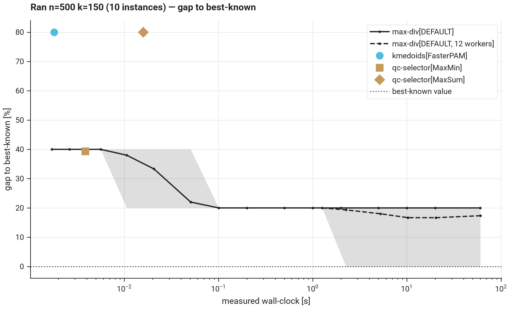

## V. Tables

The [tables page](tier3_tables.md) lists per group the mean and worst gap at 1 s and 60 s for both series, the matched/exceeded/below counts at 60 s, every entrant's mean gap, the Glover match count, and the best-known table with its provenance.
