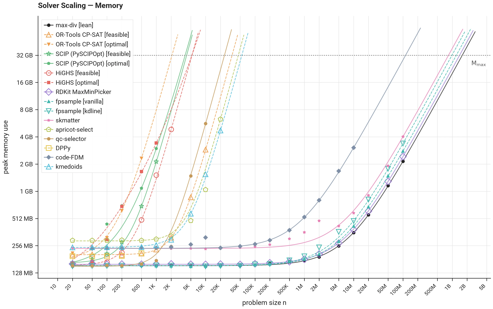

# Solver Scaling — Memory

The **largest n within memory** is the largest problem size a configuration handles within the memory budget `M_max` (32 GB peak RSS, the solver's own allocations plus the input vectors). It is derived from the same runs as the [time page](time.md): a configuration whose size sweep ended by crossing the cap is bracketed at its last completed size, and every other configuration is extrapolated — a constrained fit of peak RSS against `n` over its largest completed sizes, read off at the cap. The [measurement protocol](protocol.md) defines the fit and its bounds.

*Measured with max-div v0.14.2. Only the smoke subset — max-div, RDKit MaxMinPicker, and DPPy — is measured; the remaining solver configurations are not yet.*

Dots are recorded peaks; dashed curves are each configuration's fitted growth, drawn up to the memory cap. A flat left end is the interpreter's fixed footprint, which is why only the largest completed sizes feed the fit.

--8<-- "generated/scaling_memory.md"
