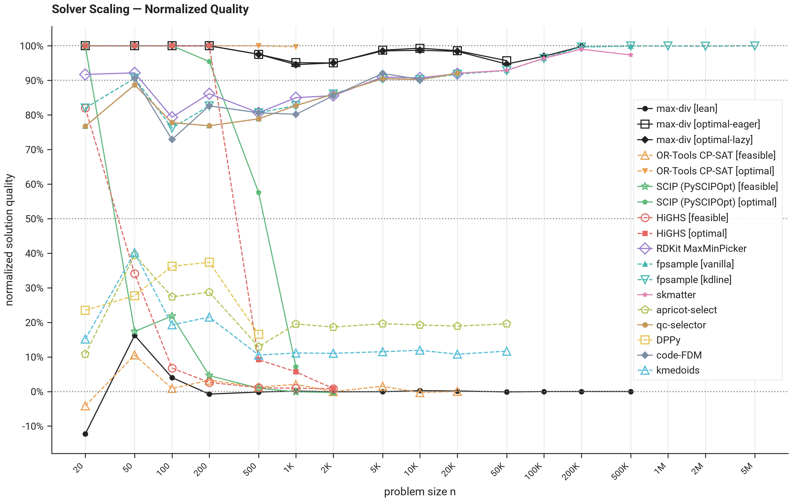
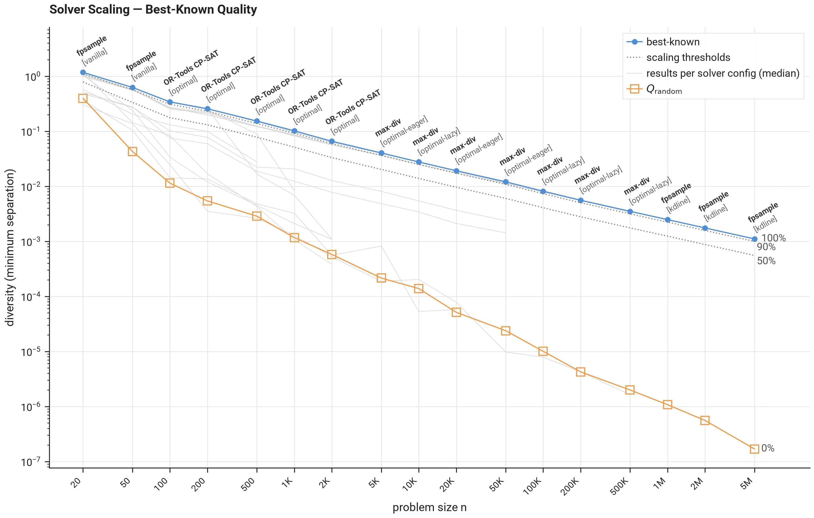

# Solver Scaling — Quality

The **largest n with normalized quality ≥ 50% / ≥ 90%** (0% at a random selection, 100% at the best-known solution) is the largest problem size up to which a configuration's median solution quality reaches that threshold at every measured size, per the [measurement protocol](protocol.md) (section IV.D).

The scoring objective (minimum separation under L2) was chosen because it is the one most benchmarked tools can pursue. Tools designed specifically for this objective are measured on the objective they were built for; tools supporting a wider range of distance and diversity metrics (see the [comparison table](../comparison.md)'s metric axes) are compared on this shared objective only.

--8<-- "generated/scaling_quality.md"

## Detailed Results

Each configuration's curve is its median's **normalized solution quality** at each size, connected across sizes. The gray dotted lines mark the 0%, 50%, 90% and 100% levels; a curve dipping below zero is a configuration worse than a random selection at that size.

Percentages rising with n say more about the reference than about the solver: the best-known solutions come from a fixed extended budget, so they are less converged as n grows, and at the largest sizes they come from the same fast tools being judged.

A high percentage there means the solver matches the best *known* solution, not that it approaches the optimum — the reason the [protocol](protocol.md) (section IV.D.4) ends a passing range at the first failing size.

## Best-Known Solutions

The **best-known solution** per problem size is the reference the quality verdicts are judged against. Both are the best over every measured run — the extended runs and the reference-budget quality runs of the [measurement protocol](protocol.md) (section IV.D) — and the normalized quality above is measured on the band between them.

