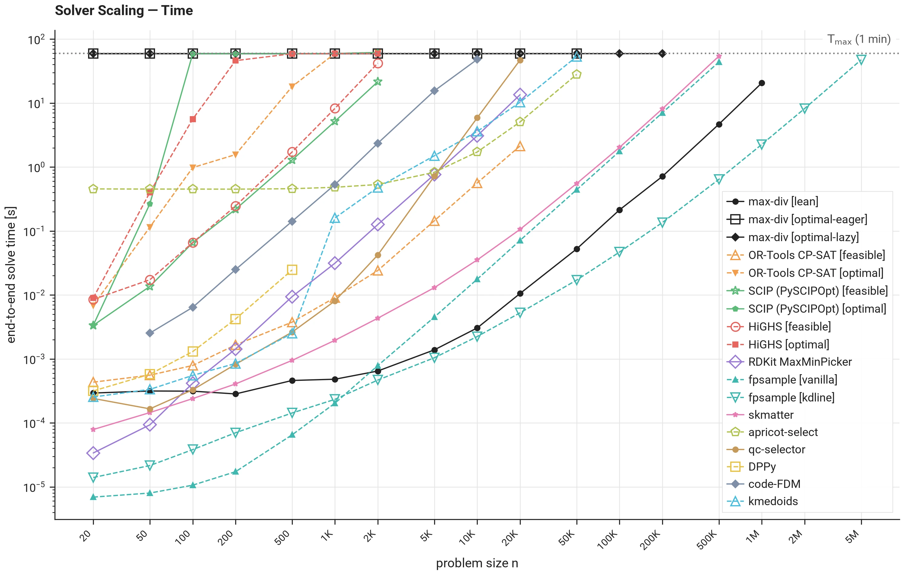

# Solver Scaling — Time

The **largest n within the time budget** is the largest problem size a configuration solves within `T_max`, end to end. The values below come from the time sweep of the [measurement protocol](protocol.md) (section IV.C); the [solver configurations page](solver_configs.md) lists every configuration.

*Measured with max-div v0.14.2. Only a limited set of solvers — max-div, RDKit MaxMinPicker, and DPPy — is measured; the remaining solver configurations are not yet.*

Runs that completed are shown, including any that finished past the time budget; killed runs have no measured time and do not appear. Configurations that spend the whole time budget by design (max-div `optimal-*`) track the `T_max` line — their limit is the size where even the full budget no longer suffices.

--8<-- "generated/scaling_time.md"
