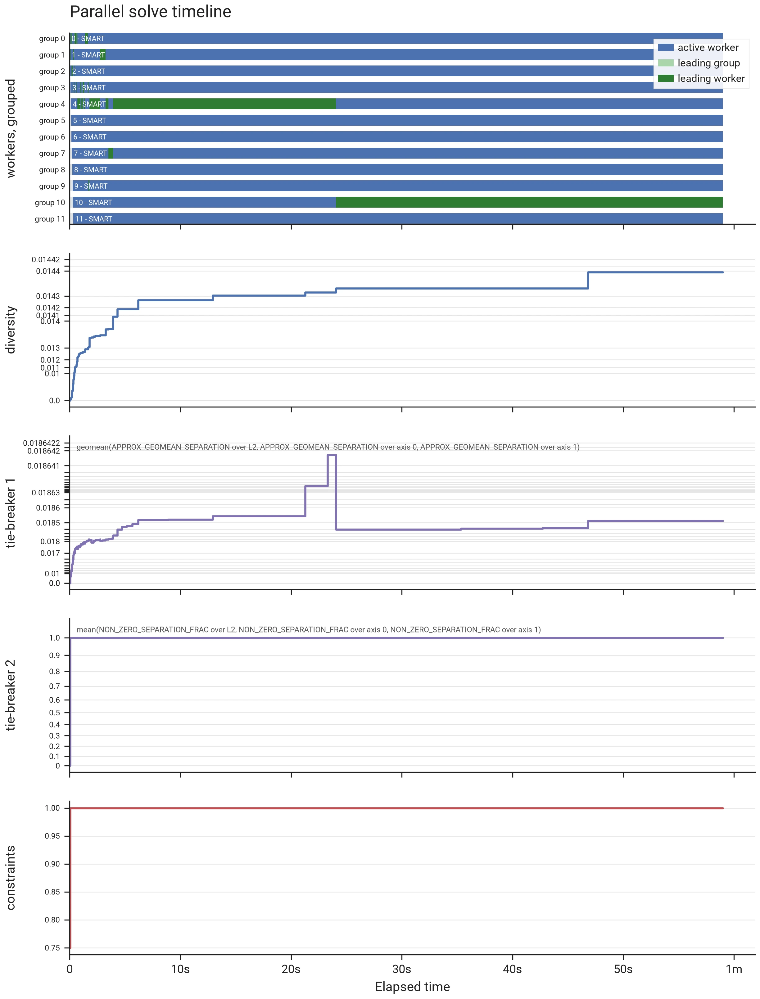
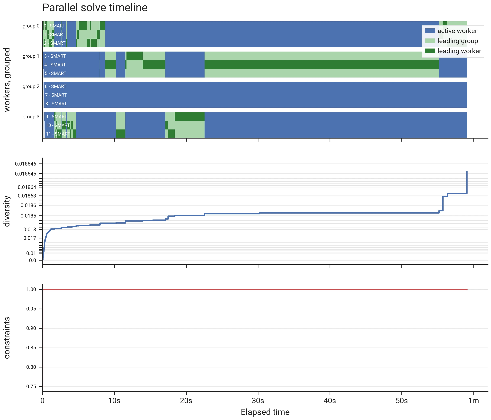
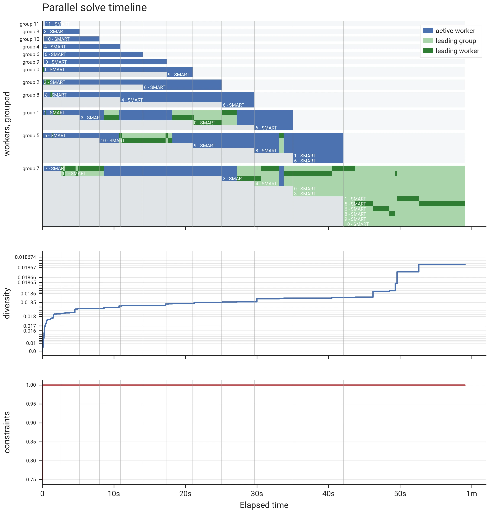

# Parallel solving

`ParallelMaxDivSolverBuilder` runs several workers on one problem at once — an **algorithm
portfolio** — and keeps the best result any of them reached. The workers share one copy of the
distances, which are usually the most memory-intensive structure in a solve, so N workers cost N
processes but not N copies of that data.

The workers form **[worker groups](glossary.md#worker-group)** — the parallel-metaheuristics
literature calls them *islands*: within a group, every worker adopts the best selection any
member has found so far, exchanged many times per second while solving; groups never communicate
with each other. Groups of one worker are fully independent. By default the
grouping is **dynamic** — it evolves during the solve (described under
[Workers and Groups](#workers-and-groups)); `with_custom_worker_groups` keeps it fixed instead.

```python
from max_div.solver import ParallelMaxDivSolverBuilder, WorkerConfig, seconds

solution = (
    ParallelMaxDivSolverBuilder(problem)
    .with_seed(42)
    .with_workers(seconds(60), 8)   # 8 workers, dynamically grouped (the default)
    .build()
    .solve()
)
```

## I. Why run several { #why-run-several }

The two counts buy different things:

- **More groups**: variance reduction. A run's quality depends on its seed, and keeping the best
  over several independent groups insures against drawing a bad one.
- **Larger groups**: shared search capacity. A group's members pool their effort on promising
  selections — a member stuck with a poor selection picks up a sibling's better one and continues
  from there — at the cost of searching less independently.

How much the variance reduction buys depends on the budget. The [published preset quantiles](../benchmarks/solver/presets_u1.md)
show the seed spread narrowing sharply as budgets grow — roughly tenfold over the first stretch —
and then flattening rather than vanishing.

Even at that flattened level the bands of neighboring budgets overlap, so an unlucky seed with more budget can
still finish below a lucky one with less.

The dynamic default removes the need to trade the two counts against each other.

## II. Workers and groups { #workers-and-groups }

Two builder methods configure the workers, and each implies its grouping:

- **`with_workers(budget, n_workers)`** — the simple path: that many default workers, grouped
  **dynamically**;
- **`with_custom_worker_groups(budget, workers, n_groups)`** — the custom path, with a **fixed**
  grouping; `workers` takes an integer (grouped into `n_groups` groups), a flat sequence of
  `WorkerConfig` (one configuration per worker), or a nested sequence (one inner sequence per
  group, fixing the grouping and every configuration at once).

The worker total, when not given, defaults to **3/4 of the logical cores** on either path.

**Dynamic grouping.** On the `with_workers` path, the group count follows a schedule over the
workers' progress through the budget:
{ #dynamic-grouping }

- every worker starts in its own group;
- the group count decreases toward one all-worker group, following `n_workers · (1 − progress)^rate`,
  where `rate` is the `group_merge_rate` argument of `with_workers`:
    - the default of 2 drops the count quickly at first, giving the best-scoring groups extra
      workers while most of the budget is still ahead;
    - a rate of 1 spreads the merges evenly over the budget;
    - a larger rate starts the solve with the count dropping that many times faster than under
      a rate of 1, so the merges happen sooner;
- each decrease dissolves the group whose shared best selection scores worst, and its workers
  join the strongest groups still short a member — reinforcing searches that can still win.

Each worker evaluates the schedule against its own progress, so the schedule works for time and
iteration budgets alike:

- under a time budget, every worker sees nearly the same fraction;
- under an iteration budget, the schedule follows whichever worker crosses each threshold first.

**Fixed grouping.** On the `with_custom_worker_groups` path the grouping never changes
mid-solve. Without an explicit `n_groups`:

- the group count defaults to **groups of about four workers** (the count nearest a quarter of
  the worker total; five workers or fewer form a single group);
- a worker total that does not divide evenly over an explicit `n_groups` hands the extra workers
  to the first groups.

### II.A. The 3 groupings on one problem { #the-three-groupings-on-one-problem }

The timelines below are 3 solves of 60 s of the
[banded hybrid experiment](../guides/uniform_sampling.md#vb-exact-counts-per-band) of the
uniform-sampling case study, 12 workers each, from the same seed. Each is drawn by
`ParallelMaxDivSolution.plot_timeline()` (the `plot` extra) from the solution's own records. In
every figure:

- **the top panel** shows one band per worker, stacked into a block per group, the shortest-lived
  groups on top. A worker's band takes one of 3 colors:
    - **blue** while it searches;
    - **light green** while its group holds the best selection;
    - **dark green** on the worker that reported that selection at a checkpoint, one of the
      moments at which the solver records the best score.

    Inside a group the lead changes hands more often than checkpoints are taken, so the light
    green, not the dark green, shows the true extent of a group's lead;
- **the lower panels** trace 2 scores. The first is the best diversity any worker held, on an
  axis that is logarithmic in its upper range, which expands where the small, late gains appear.
  The second is the constraints score (one when all constraints are satisfied), drawn only
  because it dips below one during initialization.

**12 independent workers** (`with_custom_worker_groups` with `n_groups=12`): nobody shares, so
the lead simply passes to whichever worker is ahead, and the 11 others' work never contributes
to the result.



**4 fixed groups of 3** (`n_groups=4`): a member that finds a better selection hands it to
its 2 group mates within a fraction of a second, so the whole group turns light green and the
3 continue from the same selection. Group 2 never led, and its 3 workers' search stayed
with it.



**12 dynamically grouped workers** (`with_workers`, the default): every worker starts alone,
the [default schedule](#dynamic-grouping) of rate 2 dissolves the first group after 2 seconds
and has halved the count by about 18 s, and one all-worker group remains from about 42 s on. Each dissolution moves workers into the groups still ahead,
which is where the late gains in the diversity panel come from.



## III. What varies per worker { #what-varies-per-worker }

Each worker is configured by a `WorkerConfig`: the preset it runs, and optionally the
initialization strategy it starts from. `init_strategy` lets two workers run the same preset from
different starting points.

Everything that decides **which selection is better** is fixed for all workers, whether that
setting comes from the problem (the diversity metric, the constraints) or from the builder (the
tie-breakers, the constraint penalty). Comparing what workers found requires a single answer to that
question.

Distance storage is fixed for a different reason: the workers read one shared buffer.

## IV. Seeds and reproducibility { #seeds-and-reproducibility }

The parallel solver takes one seed and derives a seed per worker from that seed, so the workers search
differently while the whole configuration derives from a single number.

**Reproducibility follows the grouping.** A fully independent set of workers
(`with_custom_worker_groups` with `n_groups` equal to the worker count) repeated from one seed
returns the same selection. With cooperating groups —
the dynamic default included — it does not.

Which selections get adopted — and, under the dynamic grouping, which groups get dissolved —
depends on how far each worker has come when it reaches an exchange, and that timing varies from
run to run.

Each worker's `WorkerSummary` carries its derived seed, the configuration it ran, and when it started
on the shared time axis (`t_start_offset_sec`, zero for the earliest worker). For an
independent worker that is enough to replay it on its own with `MaxDivSolverBuilder`; a
cooperative worker's trajectory also depends on what its group mates published, so the replay
contract is independent-only. The limits in the [Reproducibility](distance_storage.md#reproducibility) section apply
on top.

## V. Reading the result { #reading-the-result }

`solve()` returns a `ParallelMaxDivSolution`: the winning worker's selection, with a `WorkerSummary`
per worker attached. Its `score_checkpoints` trace the best score any worker held at each moment,
each checkpoint naming the worker that held it and the group it was in, on one time axis that starts
at the earliest worker start. A single worker's own trace steps up whenever that worker adopts its
group's best, which shows another worker's progress as a step in this worker's trace and hides which
worker made it; the trace across workers instead attributes each step to the worker that made it.

When the solve is built with `with_intermediate_selections()`, each checkpoint also carries the
selection held at that moment, so the checkpoints replay how the best selection evolved; the switch
is off by default because it costs k integers per checkpoint.

A dynamic solve also records its regrouping. `initial_worker_groups` gives each worker's group at
the start, and `worker_group_changes` every dissolution since, on the same time axis as the
checkpoints. Each change names:

- the worker that executed it,
- when it happened,
- which group dissolved,
- and where its workers went.

The number worth looking at is `n_workers_with_best_score`:

- **Well below the worker count**: seeds mattered on this problem, and the parallel solve earned its
  cost.
- **Equal to the worker count**: every worker tied. With a fully independent set of workers that means
  the run found nothing a single worker would not have — lower the worker count or solve once.
  With cooperating groups, ties *within* a group are partly structural (members adopt each
  other's best), so read the count against the number of groups — read against the worker
  count, those structural ties would look like independent confirmations. Under the dynamic
  default, which ends in one all-worker group, an all-worker tie is the expected outcome.

A `ParallelSolvingWarning` is raised for configurations that cannot help — a single worker, or more
workers than the machine has cores.

## VI. Watching progress { #watching-progress }

`solve(verbosity=...)` takes the same levels as a single solve (see `Verbosity`), rendered as **one
combined live view** rather than N interleaved streams; the default is the progress table, the level
suited to longer runs. A row combines two halves with different sources:

- **Progress** (the fraction, iteration count and elapsed time) follows the *slowest still-running
  worker* — the fraction tracks when `solve()` will return, and reaches 100% exactly when it does.
- **The result columns** show the *best score found so far* by any worker, running or finished,
  with the `Worker` column naming the worker it came from (marked `✓` once that worker finished).

So a frozen best while progress keeps advancing simply means the leading worker is done and nobody
has beaten it yet — the `Active` column shows how many workers are still trying. Each worker prints
one set-off row with its final state the moment it finishes.

## VII. On the word "portfolio" { #on-the-word-portfolio }

Running several configurations of one solver concurrently and keeping the best is known as an
algorithm portfolio, an idea introduced by Huberman, Lukose and Hogg (1997) and developed by Gomes
and Selman (2001).

The word also names a different technique, **algorithm selection**: reading a problem's features to
predict, and then run, the single algorithm best suited to it. That is not max-div's sense — max-div
runs several at once and keeps the best.

Portfolio workers may run independently or share what they learn as they go — ManySAT (Hamadi,
Jabbour and Sais, 2009) shares. max-div sits in between: group members share their best selection,
while groups never exchange information.

**References**

- Huberman, B. A., Lukose, R. M., & Hogg, T. (1997). An economics approach to hard computational
  problems. *Science*, 275(5296), 51–54.
- Gomes, C. P., & Selman, B. (2001). Algorithm portfolios. *Artificial Intelligence*, 126(1–2),
  43–62.
- Hamadi, Y., Jabbour, S., & Sais, L. (2009). ManySAT: a parallel SAT solver. *Journal on
  Satisfiability, Boolean Modeling and Computation*, 6(4), 245–262.
