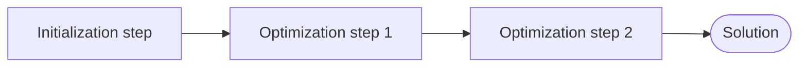

# The solve pipeline

## I. Steps { #steps }

When you call `solver.solve()`, the solver executes a pipeline of **steps**:

1. **Initialization step** -- builds the initial [selection](glossary.md#selection) of `k`
   [items](glossary.md#item)
2. **One or more optimization steps** -- iteratively improves the selection

Each step runs for a configured duration (wall-clock time or iteration count) and operates
on a shared solver state that tracks the current selection, separations, and constraint
satisfaction.



## II. Initialization strategies { #initialization-strategies }

The initialization step selects the initial `k` items. Different strategies trade off
speed vs quality of the starting point:

| Strategy | How it works |
|----------|-------------|
| `random_selection` | Selects all `k` items at random: uniformly when the problem has no constraints or `ignore_constraints=True`, otherwise steering the draw so the selection satisfies the constraints. **Default for a builder without an explicit initialization, and for the RANDOM and GUIDED presets** (which set `ignore_constraints=True`). |
| `farthest_point` | A seeded random start item, then greedily adds an item far from the selection (farthest-point sampling; under `MEAN_PAIRWISE_DISTANCE`, greedily maximizes mean distance to the selection). Each pick samples uniformly among the `top_k` best candidates (default 8; 1 is the exact greedy construction). Under a single separation-family metric, the picks are drawn in rounds of up to `batch_size` per pass over the dataset, Each pick still gets the same candidates as picking one item per pass, and large n is several times faster; `batch_size=None` picks 1 item per pass. Constraint-unaware. **The SMART and THOROUGH presets initialize unconstrained problems this way.** |
| `most_feasible` | Constructs a selection satisfying every constraint where one can be found, so optimization starts feasible instead of searching for feasibility; where the constraints provably cannot all be met, starts from a least-infeasible one; and otherwise from the least-violating one found. **Constrained problems only** — raises on a problem with no constraints. |

## III. Optimization strategies { #optimization-strategies }

Optimization steps iteratively improve the selection through [**swap operations**](glossary.md#swap): in each
iteration, the strategy removes one or more items from the current selection and replaces
them with new ones. The swap is kept only if it improves the score.

| Strategy | How it works |
|----------|-------------|
| `random_swaps` | Randomly selects items to remove and add. Simple baseline. |
| `guided_swaps` | Biased toward removing low-separation items and adding high-separation ones. |
| `smart_swaps` | Adaptively learns which swap sizes and candidate selection strategies work best during the run. |

## IV. Presets vs custom configuration { #presets-vs-custom-configuration }

**Presets** (configured via `with_preset`) select appropriate initialization and optimization
strategies automatically. They are the recommended starting point for most users.

For advanced use cases, you can configure the pipeline manually:

```python
from max_div import (
    MaxDivSolverBuilder, MaxDivProblem,
    InitializationStrategy, OptimizationStrategy,
    seconds, iterations,
)
from max_div._core.solver._solver_step import OptimizationStep

solver = (
    MaxDivSolverBuilder(problem)
    .set_initialization_strategy(InitializationStrategy.farthest_point(top_k=8))
    .add_solver_step(OptimizationStep(OptimizationStrategy.guided_swaps(), seconds(10)))
    .add_solver_step(OptimizationStep(OptimizationStrategy.smart_swaps(
        swap_size_max=4, nc_remove_max=8, nc_add_max=8,
    ), seconds(30)))
    .build()
)
```

This gives you full control over which strategies run, in what order, and for how long.
