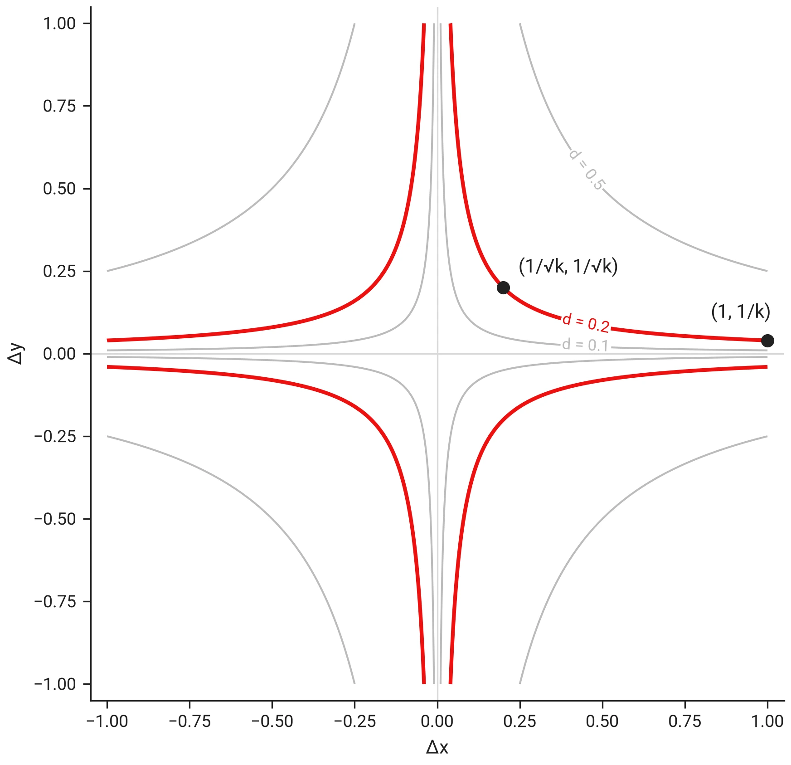

# When to use the geometric-mean distance

!!! info "In short"
    This page shows a common use case where the geometric-mean [distance metric](../concepts/glossary.md#distance-metric) is particularly useful, beyond what might be self-evident from looking at the metric's formula itself.

## I. Randomized uniform selections use case

Some applications need a set of $k$ tuples that look uniformly spread over a hypercube, without being a regular grid: the inputs of a test campaign, or the starting points of an optimizer. Take the two-dimensional case, $k$ tuples $(x_i, y_i)$ in the unit square:

$$S = \{(x_i, y_i) \mid i = 1, \ldots, k\}, \qquad 0 \le x_i, y_i \le 1.$$

Uniform spread in the square means every tuple is far from its nearest neighbor. With $k$ points sharing a unit of area, the area per point is $1/k$, so the ideal nearest-neighbor distance is about the square root of that area:

$$\text{sep}_{2D}(i) = \min_{j \neq i} \sqrt{(x_i - x_j)^2 + (y_i - y_j)^2} \;\approx\; \frac{1}{\sqrt{k}}.$$

Often the marginal distributions matter as well: when each input dimension is tested on its own, the $x$ values alone should also cover $[0, 1]$ evenly, and so should the $y$ values. Along one dimension the $k$ values share a unit of length, so the ideal nearest-neighbor distance is about $1/k$:

$$\begin{aligned}
\text{sep}_x(i) &= \min_{j \neq i} |x_i - x_j| \;\approx\; \frac{1}{k}, \\
\text{sep}_y(i) &= \min_{j \neq i} |y_i - y_j| \;\approx\; \frac{1}{k}.
\end{aligned}$$

A selection that is uniform in the square is not automatically uniform in its marginals: two points can be far apart in 2D while sharing the same $x$ value. Maximizing the usual Euclidean separation delivers the spread in the square and ignores the marginals.

The values $1/\sqrt{k}$ and $1/k$ say how the 2D and the marginal separations are expected to scale with $k$, not what a selection can reach. The three separations compete for the same $k$ points, so a selection that maximizes all three at once will typically fall short of each target on its own.

## II. Geometric-mean distance metric

The geometric-mean distance between two tuples is the geometric mean of their per-dimension gaps, in two dimensions

$$d(p, q) = \sqrt{|x_p - x_q| \cdot |y_p - y_q|};$$

the [distance-metric table](../concepts/diversity.md#distance-metrics) gives the general form and its properties.

The level curves of this distance are hyperbolas $|\Delta x| \cdot |\Delta y| = d^2$. The curve at $d = 1/\sqrt{k}$ passes through both ideal nearest-neighbor distances of section I at once:

- $(1/\sqrt{k}, 1/\sqrt{k})$: a neighbor at the 2D spacing in both coordinates;
- $(1, 1/k)$: a neighbor across the whole square in one coordinate and at the marginal spacing in the other.

The figure shows the curve family for $k = 25$:

So a selection whose smallest geometric-mean distance is about $1/\sqrt{k}$ keeps every pair of points either apart in the square or apart in each marginal. Maximizing separation under this metric therefore spreads the selection in the square and in its marginals at the same time.

## III. Example

Here $k = 100$ points are selected from a population of $n = 10{,}000$ in the unit square: the $n$ evenly spaced values in $[0, 1]$ as $x$, paired with a random permutation of the same values as $y$. The population is uniform in the square, and by construction no two points share a coordinate: every marginal is spaced $1/(n-1)$ apart.

The selection runs under geometric-mean separation with the geometric-mean distance, on 16 workers with a 60 s end-to-end budget:

--8<-- "generated/geomean_distance_example_figure.html"

For most points the nearest neighbor is not the closest red point in the square but one that shares almost the same $x$ or $y$ value: the neighbor that sets the point's marginal spacing.

The red points spread over the square, and the rug marks along the two edges show the marginals: the hundred $x$ values and the hundred $y$ values each cover $[0, 1]$ without gaps or clusters. Measured under the Euclidean distance, the selection's separations sit below but close to the targets of section I, in 2D and in each marginal, as expected of three quantities optimized at once:

--8<-- "generated/geomean_distance_example_separations.md"
