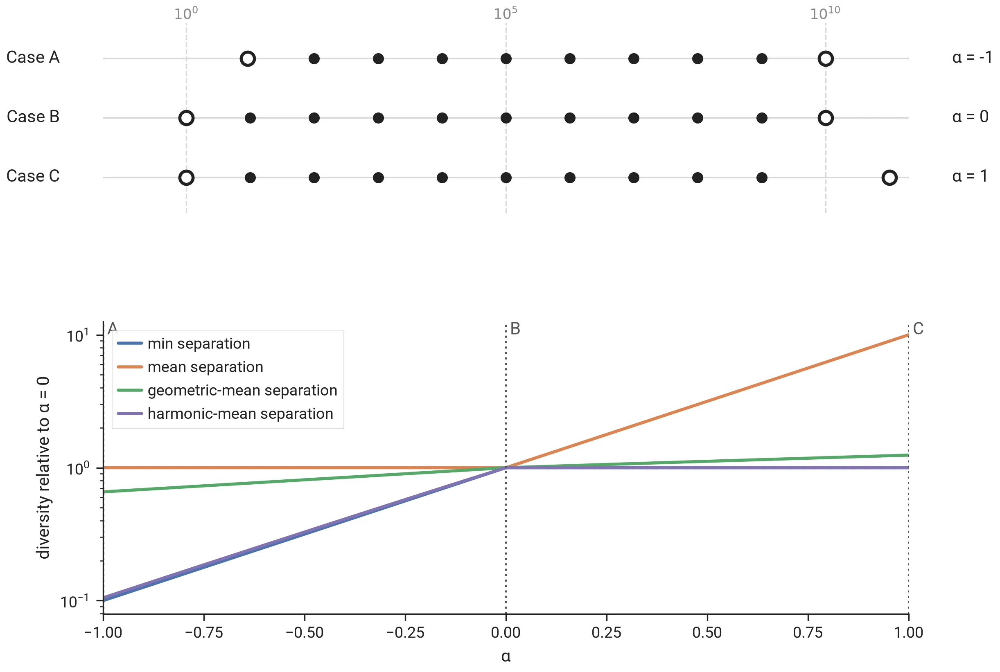

# Why geometric-mean separation is the default objective

!!! info "In short"
    This page shows how the [geometric-mean separation](../concepts/glossary.md#geometric-mean-separation) [diversity metric](../concepts/glossary.md#diversity-metric) combines the best of both worlds of [minimum](../concepts/glossary.md#max-min) and mean [separation](../concepts/glossary.md#separation) metrics, how it drives the solution towards a uniform distribution and why it is _especially_ useful for constrained diversity problems.

## I. Pros & cons of different diversity metrics

| | min separation | mean separation | geometric-mean separation | harmonic-mean separation |
|---|:---:|:---:|:---:|:---:|
| Accounts for diversity beyond the closest item pair (I.1) | ❌ | ✅ | ✅ | ✅ |
| Strongly penalizes near-duplicate items (I.2) | ✅ | ❌ | ✅ | ✅ |
| Steers towards uniform spacing, at any k (I.3) | ✅ | ❌ | ✅ | ✅ |
| Reacts to separations of every order of magnitude (I.4) | ❌ | ❌ | ✅ | ❌ |
| Cheap to compute (I.5) | ~ | ✅ | ❌ | ✅ |

### I.1. Minimum separation only measures the closest item pair

Consider a selection of $k = 11$ items on a line, at positions

$$x_1 = 0, \qquad x_2 = 0.1, \qquad x_i = 0.1 + (i - 2)\,\alpha \quad \text{for } i = 3, \ldots, 11,$$

so the first two items are always $0.1$ apart and every further item follows the previous one at distance $\alpha$. At $\alpha = 0.1$ the selection is uniformly spaced; a larger $\alpha$ spreads the last nine items out while the closest pair stays where it is.

> The minimum separation diversity metric fails to take into account diversity beyond the closest selected item pair.

### I.2. Mean separation barely penalizes near-duplicate items

Consider a selection of $k = 11$ items uniformly spaced over $[0, 1]$, except for the second item, which sits at $\alpha$:

$$x_2 = \alpha, \qquad x_i = \frac{i - 1}{10} \quad \text{for } i \neq 2.$$

At $\alpha = 0.1$ the selection is uniform; as $\alpha$ approaches $0$ the second item becomes a near-duplicate of the first.

![Eleven items uniform over [0, 1] except the second at α; the four metrics against α](./images/geomean_separation_I2.webp)

> The mean separation diversity only weakly penalizes near- or exactly duplicate items.

### I.3. Incentives towards uniform selections

Consider a selection of $k = 51$ items on $[0, 1]$ at positions

$$x_i = \left(\frac{i}{50}\right)^{\frac{2 - \alpha}{\alpha}} \quad \text{for } i = 0, \ldots, 50.$$

At $\alpha = 1$ the selection is uniform; below it the items crowd towards $0$, above it towards $1$.

> Mean separation is mostly influenced by the total span of items (here: 1.0), much less so by the smaller distances (only the smallest distance between items counts twice instead of once towards the average), especially for larger k.

### I.4. Separations of different orders of magnitude

Consider a selection of $k = 11$ items at $1, 10, 100, \ldots, 10^{10}$, so that every separation is ten times the previous one. A positive $\alpha$ moves the largest item further out, growing the largest separation by a factor $10^{\alpha}$; a negative $\alpha$ moves the smallest item toward its neighbor, shrinking the smallest separation by the same factor.

The positions are drawn on a logarithmic axis, and each metric is drawn relative to its value at $\alpha = 0$, since the four metrics differ by orders of magnitude themselves.

Each metric that is not the geometric mean does not react to changes on one side:

- **mean separation** follows the largest separation and does not react when the smallest one shrinks tenfold;
- **min separation** and **harmonic-mean separation** follow the smallest separation and do not react when the largest one grows tenfold: the harmonic mean is the count over the sum of reciprocals, and the smallest separations dominate that sum;
- **geometric-mean separation** reacts on both sides, because a tenfold change of any one separation moves the mean of the logarithms by the same amount whichever separation it is.

> When separations span orders of magnitude, as constraints can induce (section II), only the geometric mean keeps an incentive on every part of the selection. The harmonic mean shares the geometric mean's other strengths, but here it behaves like the minimum.

### I.5. Computational cost

The [diversity-metric timing benchmark](../benchmarks/internal/bm_diversity_metrics.md) times each metric on one separation vector; the geometric mean of its timings over sizes 10 to 20,000:

| metric | time per evaluation | relative | considered fast |
|---|---|---|:---:|
| mean separation | 0.20 µs | 1.0× | ✅ |
| harmonic-mean separation | 0.23 µs | 1.1× | ✅ |
| min separation | 0.58 µs | 2.9× | ~ |
| geometric-mean separation | 1.45 µs | 7.2× | ❌ |

Min separation is slower than its simplicity suggests: taking a minimum is an implicitly conditional operation, which is harder to vectorize than a sum.

## II. Diversity metrics & constrained problems

All these properties come together when dealing with constrained problems, of which the following illustration is a minimal example.

Consider a selection of $k = 51$ items of which a constraint forces the first $26$ into $[-0.25, 0]$, where they sit uniformly spaced; the remaining $25$ items have the whole of $(0, 1]$ to themselves:

$$\begin{aligned}
x_i &= -0.25 + \frac{i}{100} & \text{for } i &= 0, \ldots, 25, \\
x_i &= (1 - \alpha)\,t_i + \alpha\,t_i^2 \quad \text{with } t_i = \frac{i - 25}{25} & \text{for } i &= 26, \ldots, 50.
\end{aligned}$$

At $\alpha = 0$ the free items are uniformly spaced; a positive $\alpha$ crowds them towards the constrained group, a negative one away from it.

> In constrained problems, where constraints can create regions with different item densities, both geometric-mean and harmonic-mean separation keep an incentive to drive the solution to uniform distributions within each region, leading to natural looking solutions that align well with expectations. Geometric-mean separation is the default because it also handles separations of different orders of magnitude (I.4): it behaves as one would intuitively expect under a wider range of conditions.
