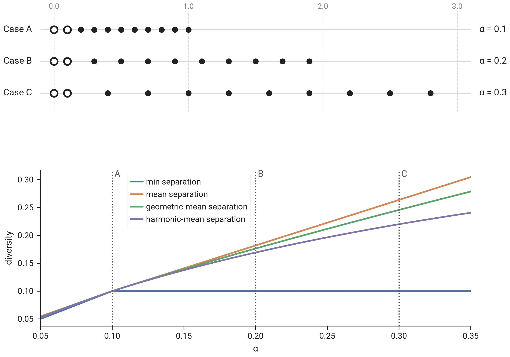
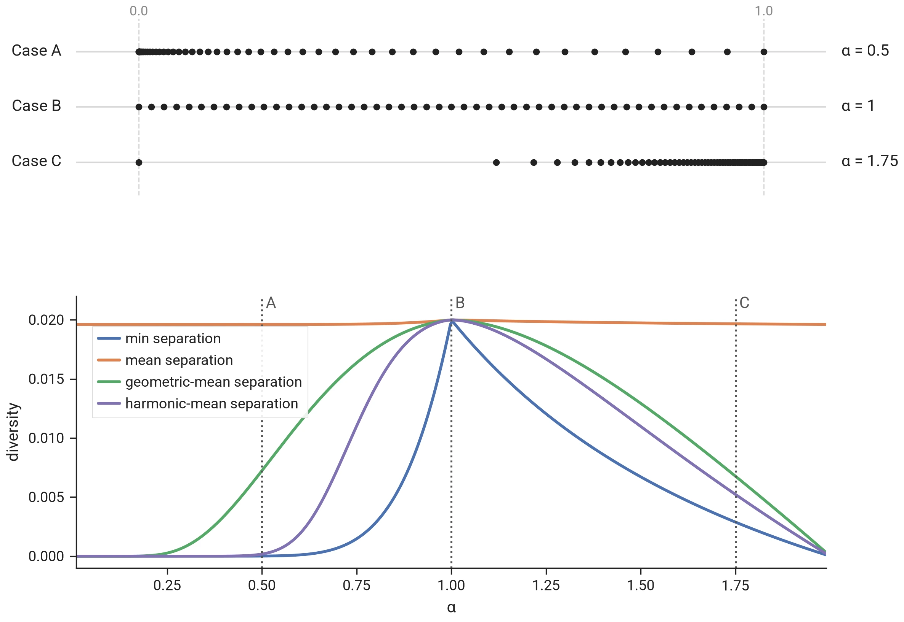
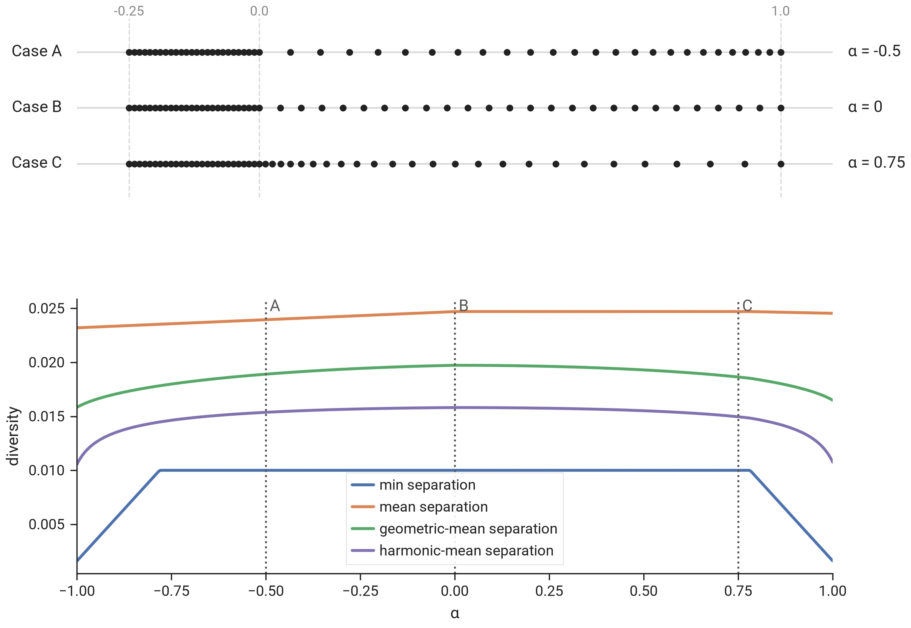

# Why geometric-mean separation is the default objective

!!! info "In short"
    This page shows how the [geometric-mean separation](../concepts/glossary.md#geometric-mean-separation) [diversity metric](../concepts/glossary.md#diversity-metric) combines the best of both worlds of [minimum](../concepts/glossary.md#max-min) and mean [separation](../concepts/glossary.md#separation) metrics, how it drives the solution towards a uniform distribution and why it is _especially_ useful for constrained diversity problems.

## I. Pros & cons of different diversity metrics

| | min separation | mean separation | geometric-mean separation |
|---|:---:|:---:|:---:|
| Accounts for diversity beyond the closest item pair (I.1) | ❌ | ✅ | ✅ |
| Strongly penalizes near-duplicate items (I.2) | ✅ | ❌ | ✅ |
| Steers towards uniform spacing, at any k (I.3) | ✅ | ❌ | ✅ |

### I.1. Minimum separation only measures the closest item pair

Consider a selection of $k = 11$ items on a line, at positions

$$x_1 = 0, \qquad x_2 = 0.1, \qquad x_i = 0.1 + (i - 2)\,\alpha \quad \text{for } i = 3, \ldots, 11,$$

so the first two items are always $0.1$ apart and every further item follows the previous one at distance $\alpha$. At $\alpha = 0.1$ the selection is uniformly spaced; a larger $\alpha$ spreads the last nine items out while the closest pair stays where it is.

> The minimum separation diversity metric fails to take into account diversity beyond the closest selected item pair.

### I.2. Mean separation barely penalizes near-duplicate items

Consider a selection of $k = 11$ items uniformly spaced over $[0, 1]$, except for the second item, which sits at $\alpha$:

$$x_2 = \alpha, \qquad x_i = \frac{i - 1}{10} \quad \text{for } i \neq 2.$$

At $\alpha = 0.1$ the selection is uniform; as $\alpha$ approaches $0$ the second item becomes a near-duplicate of the first.

![Eleven items uniform over [0, 1] except the second at α; the three metrics against α](./images/geomean_separation_I2.webp)

> The mean separation diversity only weakly penalizes near- or exactly duplicate items.

### I.3. Incentives towards uniform selections

Consider a selection of $k = 51$ items on $[0, 1]$ at positions

$$x_i = \left(\frac{i}{50}\right)^{\frac{2 - \alpha}{\alpha}} \quad \text{for } i = 0, \ldots, 50.$$

At $\alpha = 1$ the selection is uniform; below it the items crowd towards $0$, above it towards $1$.

> Mean separation is mostly influenced by the total span of items (here: 1.0), much less so by the smaller distances (only the smallest distance between items counts twice instead of once towards the average), especially for larger k.

## II. Geometric-mean separation & constrained problems

All these properties come together when dealing with constrained problems, of which the following illustration is a minimal example.

Consider a selection of $k = 51$ items of which a constraint forces the first $26$ into $[-0.25, 0]$, where they sit uniformly spaced; the remaining $25$ items have the whole of $(0, 1]$ to themselves:

$$\begin{aligned}
x_i &= -0.25 + \frac{i}{100} & \text{for } i &= 0, \ldots, 25, \\
x_i &= (1 - \alpha)\,t_i + \alpha\,t_i^2 \quad \text{with } t_i = \frac{i - 25}{25} & \text{for } i &= 26, \ldots, 50.
\end{aligned}$$

At $\alpha = 0$ the free items are uniformly spaced; a positive $\alpha$ crowds them towards the constrained group, a negative one away from it.

> In constrained problems, where constraints can create regions with different item densities, geometric-mean separation still provides an incentive to drive the solution to uniform distributions within each region, leading to natural looking solutions that align well with expectations.
